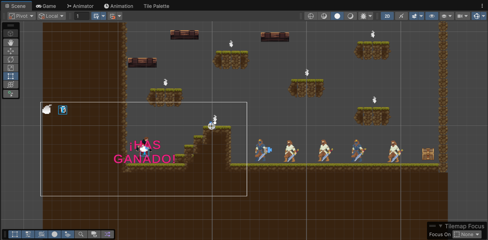

# FDV: Evaluación individual 2D

A continuación se explica de forma general el funcionamiento y la relación entre los distintos scripts del proyecto. Todos ellos trabajan en conjunto para crear una experiencia de juego tipo **plataformas 2D** en Unity, con **movimiento del jugador**, **enemigos (bandidos)**, **coleccionables**, **plataformas interactivas**, **una cámara dinámica**, y **una secuencia de victoria**.

---

## PlayerMovement.cs
Este script controla el **movimiento del jugador** y sus **interacciones físicas**:
- Lee la entrada del teclado (usando `UnityEngine.InputSystem`) para moverse, saltar y atacar.
- Usa un `Rigidbody2D` para aplicar fuerzas físicas (como el salto).
- Controla el sprite del jugador para voltearlo según la dirección de movimiento.
- Envía parámetros al `Animator` (`Speed`, `Grounded`, `IsAttacking`) para cambiar las animaciones.
- Detecta colisiones con el suelo (capa `"Terrain"`) y con enemigos (objetos con el tag `"Bandit"`).
- Si el jugador está atacando y colisiona con un bandido, llama al método `Die()` del script **Bandit**.

---

## Bandit.cs
Representa a los enemigos tipo **bandido**:
- Requiere un `Collider2D` y un `Animator`.
- Al morir (método `Die()`):
  - Cambia el parámetro `"IsDead"` del `Animator` para reproducir la animación de muerte.
  - Desactiva el collider y convierte el `Rigidbody2D` en estático.
  - Se destruye el objeto tras un pequeño retraso para permitir que la animación se vea completa.
- Evita que el método `Die()` se ejecute varias veces con el flag `isDead`.

---

## BanditPlatform.cs
Script asociado a **plataformas especiales** que desactivan a un bandido cuando el jugador aterriza sobre ellas:
- Detecta una colisión con el `Player` mediante `OnCollisionEnter2D`.
- Solo se activa una vez (`hasBeenActivated`).
- Comprueba que el jugador haya aterrizado desde arriba (comprobando la normal del contacto).
- Desactiva al bandido asignado (`banditToDeactivate.SetActive(false)`).
- Informa al componente **PlayerStats** para aumentar el multiplicador de antorchas (`IncreaseTorchValue()`).
- Cambia el color de la plataforma a gris como retroalimentación visual.

---

## Collectible.cs
Gestiona los **objetos coleccionables** (por ejemplo, antorchas o pociones):
- Detecta si el `Player` entra en su `Collider2D` con `OnTriggerEnter2D`.
- Si lo hace, accede al script **PlayerStats** del jugador y llama a `AddScore(1)` para aumentar la puntuación.
- Finalmente, destruye el objeto para simular que ha sido recogido.

---

## PlayerStats.cs
Lleva el control del **score** y el **valor multiplicador** de antorchas:
- Muestra el marcador actual mediante un `TextMeshProUGUI`.
- `AddScore(int baseAmount)` suma al marcador un valor multiplicado por `currentTorchValue`.
- `IncreaseTorchValue()` aumenta el multiplicador cuando el jugador activa una plataforma de bandido.
- `UpdateUI()` refresca el texto en pantalla con la puntuación actual.

---

## CameraSwitcher.cs
Permite alternar entre **dos cámaras Cinemachine**:
- Una cámara de seguimiento (`followCamera`) y una de grupo (`groupCamera`).
- Al pulsar la tecla **C**, cambia la prioridad de las cámaras para alternar entre ellas.
- Garantiza que una cámara esté activa por defecto (`SwitchToFollowCamera()` en `Start()`).

---

## OpenChest.cs
Define el **evento final del juego** al abrir un cofre:
- Detecta cuándo el jugador entra en su `Collider2D`.
- Lanza una **corrutina** (`WinSequence()`) que:
  1. Activa la animación de apertura del cofre (`IsOpen = true`).
  2. Muestra un texto de victoria (`winTextObject`).
  3. Espera unos segundos.
  4. Reinicia la escena (`SceneManager.LoadScene()`).
- Usa el flag `hasBeenOpened` para evitar que el cofre se abra más de una vez.

---

## Relación entre los Scripts

| Componente | Interactúa con | Propósito principal |
|-------------|----------------|---------------------|
| **PlayerMovement** | Bandit, Terrain, Animator | Movimiento, salto y ataque |
| **Bandit** | PlayerMovement | Enemigo que puede morir |
| **BanditPlatform** | PlayerStats, Bandit | Plataforma que otorga bonus y desactiva enemigos |
| **Collectible** | PlayerStats | Coleccionable que aumenta el score |
| **PlayerStats** | UI (TextMeshPro) | Gestión del score y multiplicadores |
| **CameraSwitcher** | Input (tecla C) | Cambio entre cámaras |
| **OpenChest** | Player, SceneManager | Fin del juego y reinicio |

---

## Conclusión

En conjunto, estos scripts implementan un sistema completo de juego **2D de plataformas con combate, progresión y victoria**.  
Cada clase tiene una responsabilidad clara y se comunica con las demás mediante referencias controladas (`GetComponent`, `SerializeField` y tags), promoviendo una arquitectura modular y extensible.

---

