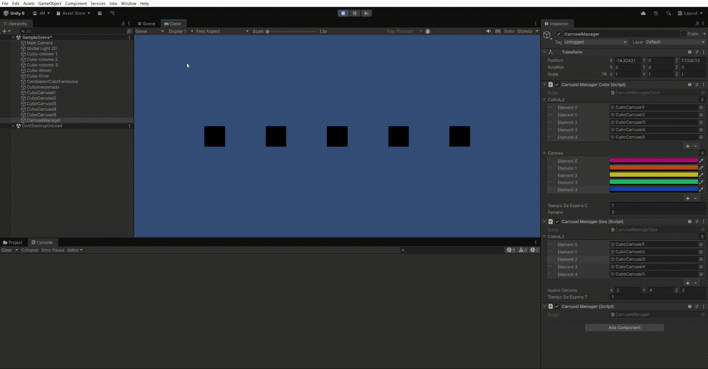

# FDV PRACTICA 1: Variables-Operadores-Métodos

## Alumno
Jaime Madico Cañete

### Demostración del carrusel

## Entorno
- Unity 6.2: 6000.2.5f1
- Plataforma: Windows

## Resumen
En la sesión 2 se trabajará las bases de la programación y programación orientada a objetos a través de ejercicios. 
Los alumnos deben crear un repositorio en Github que será utilizado para subir los scripts del proyecto. 
También se verá un ejemplo de cómo documentar la entrega de prácticas mediante documentos Markdwon.

### Ejercicio principal: El Carrusel de Colores
Ejercicio práctico en Unity el cual consistente en la definición de tres clases (CarruselManager, CarruselManagerColor, CarruselManagerSize) que separan la lógica de control, modificación de color y de escala.
CarruselManager captura entrada de teclado (Input.GetKeyDown para 'Space' y 'K') y arranca coroutines en las clases específicas mediante StartCoroutine.
CarruselManagerColor y CarruselManagerSize operan haciendo uso de arrays de GameObject, usan GetComponent para acceder a Renderer/Transform, y aplican cambios secuenciales mediante bucle for.
Para dar sensación de carrusel se usan pausas deterministas mediante yield return new WaitForSeconds(...).
El código incluye comprobaciones null, logging (Debug.Log, Debug.LogWarning, Debug.LogError) para manejo y depuración de errores. Se dan más detalles de las características del código más adelante.

## Archivos entregados
- "CarruselManager.cs"
- "CarruselManagerColor.cs"
- "CarruselManagerSize.cs"
- "ColorFantasma.cs"
- "ColorInesperado.cs"
- "ControladorMovimientoBasico.cs"
- "CuboDeColores.cs"
- "MovimientoError.cs"

---

## Ejemplos extraídos del código entregado

### Variables - Operadores - Métodos
- Variable: `public Vector3 nuevoTamano = new Vector3(2f,2f,2f);`
- Operador / método: `tamano = Mathf.Min(cubos_c.Length, colores.Length);`
- Método (coroutine): `public IEnumerator CambiarColor() { ... yield return new WaitForSeconds(tiempoDeEsperaC); }`

### Referencias a componentes
- `carruselColor = GetComponent<CarruselManagerColor>();`
- `Renderer renderer = cubos_c[i].GetComponent<Renderer>();`

### Sentencias de control
- Detección de teclas: `if (Input.GetKeyDown(KeyCode.Space)) { ... }`
- Iteración: `for (int i = 0; i < tamano; i++) { ... }`
- Comprobaciones internas: `if (cubos_c[i] != null) { ... }`

### Depuración de errores
- Mensajes de log: `Debug.Log(...)`, `Debug.LogWarning(...)`, `Debug.LogError(...)`
- Ejemplo: comprobación `null` antes de usar arrays y `yield break` en caso de error.

