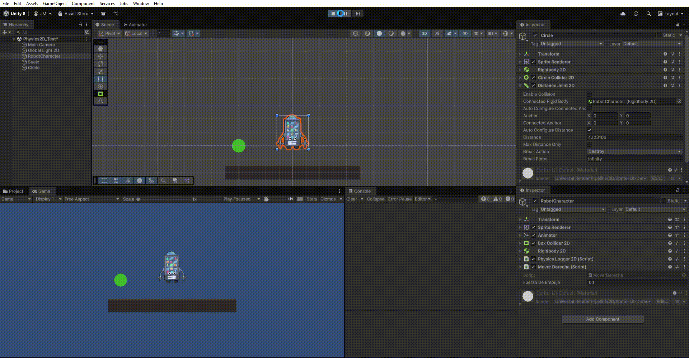

# FDV PRACTICA 3: Físicas 2D y Tilemaps

## Alumno
- Nombre: Jaime Madico Cañete
- ALU: alu0100895179
- Correo: alu0100895179@ull.edu.es

### Demostración de físicas y mapa

## Entorno
- Unity 6.2: 6000.2.5f1
- Plataforma: Windows
- Input System: Unity New Input System (UnityEngine.InputSystem)
- Motor de físicas: 2D Physics Engine (Rigidbody2D, Collider2D)
- Tilemaps: Sistema de Unity (Grid, Tilemap, Tile Palette, Composite Collider 2D)

## Resumen
En esta práctica se ha trabajado con el motor de físicas 2D y el sistema de Tilemaps de Unity para construir un entorno jugable en 2D. A partir del proyecto anterior (movimiento y animación de sprites), se ha ampliado con nuevos componentes que permiten:

- Detectar colisiones y triggers entre objetos físicos, así como diferenciar el comportamiento en ambos casos.
- Estudiar las diferencias entre las diferentes configuraciones de cuerpos (Dynamic, Kinematic, Static).
- Implementar un entorno con Tilemaps que delimita el escenario.
- Usar colliders compuestos (`composite`) para mejorar la detección de colisiones.
- Aplicar diferentes comportamientos físicos según el tipo de objeto o capa.

---

## Fichjeros más importantes entregados

- PRACTICA.md  
- Scripts/
  - RotacionYMovimientoLocal2D.cs 
  - PlayerMovement.cs
  
---

## Enunciado
En esta actividad realizaremos pruebas con el motor de físicas 2D y el editor de mapas 2D que proporciona Unity. Los componentes de mayor interés son
- Rigidbody: Acceso a las simulaciones físicas
- Collider: Detección de las colisiones.

Respecto al mapa de juego, se debe trabajar con los objetos:
- Grid
- Tilemap
- Tile Palette
- Tile map collider
- Composite collider

La descripción de las actividades a realizar se recogen en el documento de la práctica sobre mapas y físicas.
La forma de entrega será similar a las prácticas anteriores.

---

### Ejercicio 1.1 Pruebas de físicas 2D

En este ejercicio se ponen a prueba diferentes configuraciones de objetos físicos en Unity.

Se realizan las pruebas con varios objetos donde he incluido scripts en cada uno de los tipos de objetos con los que se realizan pruebas. Esto me ha permitido programar los eventos OnCollision2D y OnTrigger2D para que muestren un mensaje en la consola avisando de que se ha disparado el evento. Para producir el contacto entre los objetos se han manipulado directamente en el editor/inspector, así como la aplicación de scripts sencillos de fuerza cuando ha sido necesario.
El script protagonista que cuya función es la detección de estos eventos es: `PhysicsLogger2D`.

| Nº de Prueba | Enunciado | Desarrollo de la prueba | Conclusión | Demostración |
|---------------|------------|--------------------------|-------------|---------------|
| 1 | Ninguno de los objetos será físico. | Se colocan 2 objetos solo con **BoxCollider2D** y sin **Rigidbody2D**. | No se observa salida en la consola, ya que Unity no detecta colisiones si ninguno tiene Rigidbody2D. |  |
| 2 | Un objeto tiene físicas y el otro no. | Se añade **Rigidbody2D (Dynamic)** al **BoxCollider2D**, mientras el segundo objeto mantiene solo el **BoxCollider2D** sin Rigidbody2D. | Se muestran eventos **OnCollisionEnter2D** y **OnCollisionExit2D** en consola por parte del objeto físico. |  |
| 3 | Ambos objetos tienen físicas. | Se establecen componentes **Rigidbody2D (Dynamic)** + **BoxCollider2D** para ambos objetos. | Ambos imprimen mensajes **OnCollision2D**, ya que reaccionan físicamente al chocarse. |  |
| 4 | Ambos objetos tienen físicas y uno tiene más masa. | Configuración igual que la anterior, pero `Square` presenta **masa x20** (para acentuar el efecto) y se añade una fuerza para producir el impacto. | El impacto se produce igual, pero el motor de físicas calcula que hace falta más fuerza para desplazar el objeto pesado. |  |
| 5 | Un objeto tiene físicas y el otro es *IsTrigger*. | Un objeto presenta **Rigidbody2D (Dynamic)** + **BoxCollider2D**, y el otro solo **BoxCollider2D** con **isTrigger = true**. | Se detecta el paso por el área del segundo objeto pero sin colisión física; se muestran mensajes **OnTriggerEnter2D** y **OnTriggerExit2D**. |  |
| 6 | Ambos objetos son físicos y uno está marcado como *IsTrigger*. | Objeto1: **Rigidbody2D (Dynamic)** + **BoxCollider2D (isTrigger = true)**; Objeto2: **Rigidbody2D (Dynamic)** + **BoxCollider2D (isTrigger = false)**. | Resultado similar al anterior: detección mediante **OnTriggerEnter2D** y **OnTriggerExit2D**, sin empuje físico aunque el motor los considere. |  |
| 7 | Uno de los objetos es cinemático. | Sin triggers: ambos tienen **Rigidbody2D** y **BoxCollider2D**, pero uno es de tipo **Kinematic**; se mueve manualmente con el inspector hacia el otro. | Se muestran mensajes **OnCollisionEnter2D** al chocar; el objeto cinemático no se mueve por la física, pero sí genera el evento. |  |

---

### Ejercicio 1.2 – Restricciones en físicas 2D

En este ejercicio incorporo elementos físicos en la escena que responden a las siguientes restricciones:

#### A: Objeto estático que ejerce de barrera infranqueable
Para ello se coloca como barrera infranqueable un objeto con **BoxCollider2D** y con **Body Type = Static**.  
Se observa que el objeto dinámico choca y se detiene contra la barrera.  

#### B: Zona en la que los objetos que caen en ella son impulsados hacia adelante
Para esta prueba me apoyo en el **GameObject** que utilizo como suelo, el cual cuenta con un **BoxCollider2D** (con la opción `IsTrigger`).  
Mediante `rb = other.attachedRigidbody` accedo al objeto que ha entrado en la zona de impulso y le aplico una fuerza con `rb.AddForce(Vector2.right * fuerza)`.  
Los objetos que “caen” en la zona son detectados mediante el evento **OnTriggerEnter2D**, y se les aplica la lógica mencionada.  
Esta programación se realiza mediante un script **zonaImpulsora.cs**, que se asigna al GameObject.  

#### C: Objeto que es arrastrado por otro a una distancia fija
Aquí coloco dos **GameObjects**: ambos con **Rigidbody2D (Dynamic)**, y en el seguidor añado un **DistanceJoint2D** conectado al “líder”.  
Ambos tienen **Collider2D**.  
El seguidor mantiene la distancia fijada por el joint y es arrastrado, mostrando colisiones físicas normales contra otros objetos.  

#### D: Objeto que al colisionar con otros sigue un comportamiento totalmente físico
Para ello incorporo en la escena tres **GameObjects** (círculo, triángulo y character).  
Todos tienen **Rigidbody2D (Dynamic)** + **Collider2D (isTrigger = false)**.  
Incluyo el ya visto **PhysicsLogger2D** para observar cómo se gestionan los diferentes eventos de colisión.  
Se aplican fuerzas a dos de ellos y el tercero cae por su propio peso: se comportan según masa, velocidad y coeficientes (impulso, rebote), y emiten **OnCollision** con normalidad.  

#### E: Capas que evitan colisiones entre distintos tipos de objetos
Para esta prueba parto de la escena anterior y creo tres capas nuevas (**LayerA**, **LayerB** y **LayerC**) para los tres objetos usados previamente (asignando cada uno a una capa distinta).  
Para desactivar colisiones entre capas desmarco en la **Collision Matrix** las casillas correspondientes, como se ve en el GIF.  
Al desmarcar dichas casillas, los objetos **no generan eventos OnCollision2D ni OnTrigger2D entre sí**, aunque siguen colisionando con objetos de las capas con colisiones habilitadas.  

---

### Ejercicio 2: Sistema de TileMaps

Para este ejercicio me apoyo en las herramientas que proporciona Unity para componer las diferentes capas que permitirán conformar el mapa de juego a partir de recursos gráficos. Entre ellas destacan los elementos:  `Grid`, `Tilemap`, `Tile Plaette`y `Tiles`.

En primer lugar defino la rejilla (`Grid`) que sirve de guía para ubicar los elementos en el mapa. Este actuará como padre en la jerarquía de de los diferentes `Tilemaps` (concretamente: `Terrain_tilemap`, `Decorations_tilemap` y `Obstacle_tilemap`), en la configuración de los Tilemaps ajusté el tamaño de los tiles al de las celdas del grid (24 píxeles).

He descargado los tiles desde **itch.io**, los importé a Unity y los configuré como **Sprites (2D and UI)**. Luego los recorté en el **Sprite Editor** para ajustarlos al tamaño del `Grid`, y con ellos creé una `Tile Palette` desde la que pinté el mapa de forma ordenada y precisa, consiguiendo el resultado esperado.
Respecto a la configuración que he seguido en el ajuste de los `Tiles`, destaco que para la correcta visualización de estos sprites, incluyo la configuración:
- `Pixels Per Unit`: **24**
- `Filter Mode`: **Point (no filter)** 
- `Compression`: **None**
- `Pivot`: se ajusta pivotaje de manera individual a cada Tile (Bottom, Top, Center o Custom).

Como se muestra en la imagen el mapa representa el entorno y los límites del juego.
Además del `tilemap` principal. Añadí dos Tilemaps extra: uno decorativo (no contiene elementos físicos) y otro de obstáculos que sí generan colisiones. Para ello me apoyo en los componentes `Tilemap Collider 2D`, `Composite Collider 2D` y `Rigidbody2D (Static)`. Ajusté el orden de renderizado y la detección de colisiones continua para evitar errores visuales y físicos. Para conseguir esto, he definidido los Layers: `Background`, `Terrain`,`Decorations`, `Player` y `Foreground` (aunque de momento no se usen todos).
Estas capas se han aplicado a los objetos tilemap en el inspector sustituyendo el Layer por defecto. De esta manera defino el orden deseado asignando valores en  `Order in Layer`.

---

### Ejercicio 3: Mecánicas de movimiento

En el último bloque de tareas con el que trabajaro implemento algunas primeras versiones sencillas de mecánicas de movimiento del personaje. Se presentan 2 métodos diferentes mediante las clases: `PlayerMovement` y `RotacionYMovimientoLocal2D`.

#### Ejercicio 3.1: Clase `PlayerMovement`

En este ejercicio se desarrolló un script para controlar el movimiento de un personaje 2D utilizando el nuevo **Input System**.
La variable `speed` determina la velocidad de desplazamiento, y el método Update() se encarga de leer continuamente las entradas del teclado mediante `Keyboard.current` (se permite y revisa la pulsación de las teclas **WASD** o **← → ↑ ↓**).
El movimiento se calcula con la fórmula **espacio = velocidad * tiempo**, usando Time.deltaTime para que el desplazamiento sea suave y constante. De manera que el bloque de código que hace esto posible es:
`Vector3 movimiento = new Vector3(h, v, 0f) * speed * Time.deltaTime;`
`transform.Translate(movimiento, Space.World);`
El método `transform.Translate()` aplica la traslación en el espacio 2D, actualizando la posición del personaje cada frame.
Finalmente, el componente `SpriteRenderer` permite invertir la orientación del sprite modificando su propiedad flipX según la dirección del movimiento horizontal.

#### Ejercicio 3.2: Clase `RotacionYMovimientoLocal2D`

En este ejercicio se implementó un sistema de rotación y movimiento local en 2D mediante el nuevo **Input System**.
Las variables `speed` y `rotationSpeed` controlan respectivamente la velocidad de avance y el giro del personaje.
Dentro del método `Update()`, se capturan las teclas **A/D** o **←/→** para rotar el objeto y **W/S** o **↑/↓** para avanzar o retroceder.
La rotación se aplica con `transform.Rotate()` **sobre el eje Z**, multiplicando por `Time.deltaTime` para suavizar el movimiento.
Posteriormente, el desplazamiento se realiza con `transform.Translate()` en `Space.Self`, permitiendo que el personaje se mueva hacia la dirección que "mira" tras rotar.

