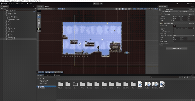
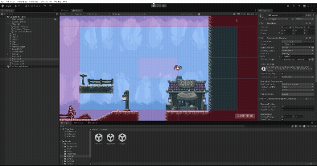
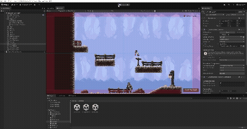
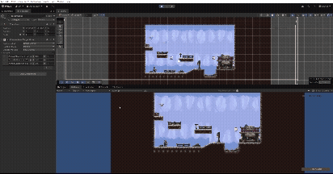

# FDV PRACTICA 4: Cámaras en Unity 2D (Cinemachine)

## Alumno
- Nombre: Jaime Madico Cañete
- ALU: alu0100895179
- Correo: alu0100895179@ull.edu.es

### Demostración de uso de la cámara


## Entorno
- Unity 6.2: 6000.2.5f1
- Plataforma: Windows
- Input System: Unity New Input System (UnityEngine.InputSystem)
- Motor de físicas: 2D Physics Engine (Rigidbody2D, Collider2D)
- Tilemaps: Sistema de Unity (Grid, Tilemap, Tile Palette, Composite Collider 2D)
- Sistema de cámaras: Cinemachine (CinemachineBrain, CinemachineVirtualCamera, Confiner, TargetGroup, Impulse)

## Resumen
En esta práctica se ha trabajado con el sistema de cámaras 2D de Unity empleando Cinemachine para gestionar el punto de vista del jugador y mejorar la calidad visual del juego. Partiendo del proyecto previo (movimiento y control del jugador), se ha incorporado la lógica necesaria para:

- Configurar varias cámaras virtuales con diferentes zonas de seguimiento y proyección ortográfica.
- Aplicar confinamiento para limitar el área visible del mapa y evitar mostrar el fondo vacío.
- Seguir múltiples objetivos mediante Target Groups, variando el peso e importancia de cada sprite.
- Introducir efectos dinámicos como zoom, sacudidas por impulsos y transiciones suaves mediante prioridades y blends.
- Permitir intercambiar cámaras tanto con teclas como desde elementos de UI.
- Activar cámara lenta y rápida en función de colisiones con objetos específicos del escenario.
- Manejar intercambio de cámaras suaves mediante parámetros de prioridad.

---

## Ficheros más importantes entregados

- PRACTICA.md  
- Scripts/
  - CameraPrioritySwap.cs
  - CameraSwitcher.cs
  - simpleLoopLateralMovement.cs
  - simpleLoopVerticalMovement.cs
  - TimeScaleScript.cs
  - ZoomController.cs

---

## Enunciado general de la práctica 

En esta práctica se desarrollará una escena 2D con varios personajes, uno controlado por el jugador, aplicando la gestión avanzada de cámaras mediante Cinemachine. Se instalará el paquete Cinemachine y se configurarán varias cámaras virtuales con diferentes modos de seguimiento, zonas de influencia y confinamiento. Se trabajará con efectos típicos de cámara como zoom dinámico, sacudidas por impulso, seguimiento a grupos de objetos y cámaras con distinta prioridad para gestionar transiciones suaves. También se implementará la activación de cámara lenta y rápida mediante colisiones, así como el intercambio de cámaras desde teclado y UI. Los componentes de mayor interés son:

- Cinemachine Brain: gestiona qué cámara virtual está activa y cómo se aplican los blends.
- Cinemachine Virtual Camera: controlador principal que sigue y encuadra al jugador u objetos específicos.
- Cinemachine Confiner: limita el área visible que puede recorrer la cámara.
- Cinemachine Target Group: seguimiento simultáneo de varios objetivos con pesos distintos.
- Cinemachine Impulse Source: genera sacudidas y efectos de impacto en la cámara.

La entrega incluirá un repositorio GitHub con scripts y gifs demostrativos, y el .zip del proyecto para el campus virtual.

---

### Tarea 1
*Instalar el paquete CineMachine y configurar 2 cámaras virtuales con diferentes zonas de seguimiento al jugador. Mostrar el efecto mediante un gif animado.*

Se instaló **Cinemachine** mediante `Package Manager`. El componente `Cinemachine Brain` (en la `Main Camera`) actúa como el director, eligiendo qué Cámara Virtual (vcam) mostrar según su prioridad (campo `Priority`en el componente "Cinemachine Camera").

Como demo se adjuntan dos GIF que permiten observar el cambio entre ambas cámaras, alternando su "Priority" (también se podría haber hecho o activándolas/desactivándolas).

Se configuraron dos vcam siguiendo al jugador `batMonster`:

#### Cámara Rígida (Seguimiento 1:1 sin "zona de muerte")
- "CM vcam1" - Cinemachine Position Composer
- Dead Zone (X,Y) = 0 
- Hard Limits (X,Y) = 1,1 
- Damping (X,Y,Z) = 0,0,0

**Resultado:** La cámara sigue brusca e inmediatamente cualquier micro-movimiento del jugador.


#### Cámara Suave (Seguimiento más profesional)
- "CM vcam2" - Cinemachine Position Composer
- Dead Zone (X,Y) = 0.2,0.2 
- Hard Limits (X,Y) = 0.8,0.8 
- Damping (X,Y,Z) = 1,1,1

**Resultado:** El jugador puede moverse en el centro sin que la cámara reaccione. Al salir de esa zona, la cámara lo sigue logrando un movimiento fluido y más elegante.


---

### Tarea 2
*Define un área de confinamiento diferente para cada una de las dos cámaras de la tarea anterior. Realiza una prueba de ejecución con el correspondiente gif animado que permita ver las diferencias.*

Se añadió el componente **`Cinemachine Confiner`** a cada una de las cámaras virtuales (`vcam`) de la Tarea 1. Esta extensión restringe el movimiento de la cámara a los límites de un `Collider 2D` (que debe estar marcado como **`Is Trigger`**).

Se crearon dos `GameObject` tipo "Empty" ("CameraLimit1" y "CameraLimit2") con `Box Collider 2D` de diferentes tamaños, asignando uno a cada `vcam` a través del campo `Bounding Shape 2D` de la extensión. Estos restringirán la zona izquierda y derecha del mapa correspondientemente.

El primer GIF muestra la configuración de la extensión en las cámaras. Los dos siguientes GIFs demuestran el efecto de cada límite, activando una u otra cámara mediante el cambio de su `Priority`.



#### Cámara 1 (Rígida): Restringido a lado izquierdo
- **Cámara**: "CM vcam1"
- **Extensión**: `Cinemachine Confiner`
- **Bounding Shape 2D**: `CameraLimit1` (Box Collider 2D ajustado a la izquierda)

**Resultado:** La cámara sigue al jugador (rígidamente) y se detiene en los bordes anchos definidos por `CameraLimit1`, impidiendo ver el lado derecho del mapa.



#### Cámara 2 (Suave): Restringido a lado izquierdo
- **Cámara**: "CM vcam2"
- **Extensión**: `Cinemachine Confiner`
- **Bounding Shape 2D**: `CameraLimit2` (Box Collider 2D ajustado a la derecha)

**Resultado:** La cámara sigue al jugador (con la configuración definida en la tarea 1) y se detiene en los bordes anchos definidos por `CameraLimit2`, impidiendo ver el lado izquierdo del mapa.



---

### Tarea 3
*Agrega varios sprites en la escena que estén realizando un movimiento (mínimo 3). Genera una cámara adicional que le haga el seguimiento a dichos objetos.*

Para este ejercicio, siguiendo la línea de trabajo de los ejercicios anteriores, usaré como *Main Character* a la criatura murciélago y añado 2 sprites animados, referidos en la jerarquía como *knightMonster* y *eyeBallMonster*, a estos les asignaré un script de movimiento muy sencillo (bucle de desplazamiento lateral y vertical respectivamente) que se entregarán junto con el resto de scripts utilizados en la práctica.

Prosigo con la creación del **"Group Camera"** (*Cinemachine > Targeted Cameras > Target Group Camera*).

Esto crea dos objetos en la jerarquía que denominaré:
- `CMTargetGroupCamera`: Nueva cámara virtual que tendrá de manera automática asociado el **Target Group** generado en el **Tracking Target**.
- `TargetGroup`: presenta el componente **Cinemachine Target Group** donde puedo añadir tantos *Targets* como elementos quiera que siga la cámara.

Tras añadir todos los actores mencionados anteriormente en el grupo, se observa como la cámara se va ajustando automáticamente en todo momento para seguirlos y mantenerlos a todos por igual en la vista.



---

### Tarea 4
*Agrega 2 sprites adicionales en la escena que estén realizando un movimiento Genera una cámara adicional que le haga el seguimiento a dichos objetos, cada uno con un peso en la importancia del seguimiento diferente.*

Este ejercicio se plantea como una continuación inmediata del anterior. Copio al monstruo *eyeBallMonster* como *eyeBallMonster-2* y *eyeBallMonsterBoss* (este segundo tendrá un tamaño superior como diseño de "una amenaza mayor"). Coneste cambio, cuento con 5 actores que la cámara deberá seguir, por ello para las pruebas  genero un nuevo:
- `TargetGroup` denominado ***TargetGroupWeight***, donde recojo los 5 elementos con diferentes pesos:

| Taget (*nombre*) | W (*Peso*) |
| :--- | ---: |
| knightMonster | 1 |
| eyeBallMonster | 1 |
| eyeBallMonster-2 | 1 |
| eyeBallMonsterBoss | 10 |
| MainCharacter | 5 |

- `CMTargetGroupCamera`: Misma cámara virtual que use en el ejercicio anterior. Solo que ahora modifico a mano el *Target Group* asociado en generado en el campo ***Tracking Target***.

Ahora ciertamente la cámara se comporta de manera ligeramente diferente, sigue haciendo manteniendo los ítems incluidos en el el grupo dentro de la vista de la cámara, pero con movimientos que tratan de dar prioridad en centrar a los elementos con mayor peso, influyendo estos más en el movimiento de la cámara.


---

### Tarea 5
*Implementar un zoom a la cámara del jugador que se controle con las teclas w-s.*

Para implementar el zoom en una *CinemachineVirtualCamera 2D*, es necesario modificar el valor de su propiedad ***Lens.OrthographicSize***. Esta propiedad nos permitirá controlar acercando o alejando la vista. Un valor menor de *OrthographicSize* produce un "Zoom In" (acercamiento), mientras que un valor mayor produce un "Zoom Out" (alejamiento).

Para controlar este valor, creo un script en C# denominado *ZoomController*, destaco las partes más importantes del código:

* Es necesario incluir la librería de control de Cinemachine: `using Unity.Cinemachine;`.
* Este script mantiene una referencia a la vcam del jugador:`public CinemachineCamera vcam;`
* Comprobando las pulsaciones de las teclas 'W' o 'S' se cacula el nuevo valor para el Zoom: `targetOrthographicSize -= zoomSpeed * Time.deltaTime;` / `targetOrthographicSize += zoomSpeed * Time.deltaTime;`
* El valor objetivo se limita ("Mathf.Clamp") para asegurar que el zoom permanezca entre márgenes predefinidos: `targetOrthographicSize = Mathf.Clamp(targetOrthographicSize, minZoom, maxZoom);`
* Finalmente, se modifica el valor a vcam.Lens.OrthographicSize. Suavizando hacia el valor objetivo ("Mathf.Lerp") en cada fotograma, evitando un cambio de zoom brusco: `vcam.Lens.OrthographicSize = Mathf.Lerp(vcam.Lens.OrthographicSize, targetOrthographicSize, Time.deltaTime * zoomSpeed);`


---

### Tarea 6
*Intercambiar las cámaras: Tarea: Seleccionar un conjunto de teclas que permitan hacer el cambio entre dos cámaras . (Habilitar/Deshabilitar el gameobject de la cámara virtual).Implementar una UI que incluya algún elemento para seleccionar que cámara se activa.*

Para gestionar el cambio entre cámaras, nos basamos en cómo opera el ***Cinemachine Brain***: este componente siempre elegirá la cámara activa (cuyo `GameObject` esté habilitado) que tenga la prioridad más alta. Por lo tanto, el método más directo es usar ***SetActive()*** para encender o apagar las cámaras virtuales.

Para centralizar esta lógica de forma escalable, he creado un script `CameraSwitcher`. En lugar de variables individuales, este script utiliza un array público, `public GameObject[] camarasVirtuales;`, donde almaceno todas las cámaras.

La clave del script es un único método público, `public void SwitchToCamera(int index)`, que recorre el array y aplica la lógica `camarasVirtuales[i].SetActive(i == index);`. Esto activa solo la cámara del índice solicitado y desactiva todas las demás.

#### Tarea 6.1: Control por teclado

Para el control por teclas, simplemente llamo al método central desde `Update()`, comprobando la tecla pulsada y pasando el índice del array correspondiente.

* Es necesario incluir la librería del nuevo Input System: `using UnityEngine.InputSystem;`.
* En `Update()`, comprobamos la pulsación (`.wasPressedThisFrame`) para que solo se ejecute una vez:
    `if (Keyboard.current.digit1Key.wasPressedThisFrame) SwitchToCamera(0);`
    `if (Keyboard.current.digit2Key.wasPressedThisFrame) SwitchToCamera(1);`
    `(etc.)`


#### Tarea 6.2: Control por UI

Para la UI, he añadido un `Canvas` con tres botones (uno por cámara). Lo más eficiente es que todos los botones utilizan el *mismo* método `SwitchToCamera(int index)` que ya creamos.

En el inspector, a cada evento `On Click()` del botón le asigno el script `CameraSwitcher` y selecciono la función `SwitchToCamera (int)`. Esto me permite pasar el índice de la cámara directamente en el Inspector:

* **Botón 'CAM 1'**: Llama a `SwitchToCamera` con el valor `0`.
* **Botón 'CAM 2'**: Llama a `SwitchToCamera` con el valor `1`.
* **Botón 'CAM 3'**: Llama a `SwitchToCamera` con el valor `2`.


---

### Tareas 7 y 8
*Crear un script para activar la cámara lenta/rápida cuando el personaje entre en colisión con un elemento de la escena.*

Para implementar la cámara lenta y rápida, modificamos la propiedad estática global **`Time.timeScale`**. Esta propiedad actúa como un multiplicador de la velocidad del juego: un valor de `1.0` es normal, `< 1.0` es cámara lenta (ej. `0.5`) y `> 1.0` es cámara rápida (ej. `2.0`).

El cambio de velocidad se activa mediante una **colisión física**, esa se maneja desde un único script llamado `TimeScaleScript.cs`. Este script se añade a 3 objetos de zona, estos tendrán sprites y animaciones de "pociones": verde para cámara rápida, rojo para cámara lenta y azul para volver a la velocidad de cámara normal. 

Las partes clave del script son:

* Una variable pública para definir la velocidad a aplicar: `public float timeScaleTarget = 0.5f;`
* El método de colisión, que detecta el `Tag` del objeto que impacta: `private void OnCollisionEnter2D(Collision2D other)`
* La comprobación del `Tag` y la aplicación del cambio de tiempo:
    `if (other.gameObject.CompareTag("Player"))`
    `{ Time.timeScale = timeScaleTarget; }`

Los tres  objetos de la escena (`RedPotion`, `GreenPotion` y `BluePotion`) tienen añadido como componente este script, así como `RigiBody` y `BoxCollider` para detectar las colisiones. Al chocar con el primero, el `Time.timeScale` se fija en `0.5`, y al chocar con el segundo, se fija en `2.0`, embargo si se produce choque con el tercero, se vuelve al valor original: `1.0`.


---

### Tarea 9
*Crear un script para intercambiar la cámara activa, una estará confinada y la otra no cuando el personaje entre en colisión con un elemento de la escena que elijas para realizar el intercambio.*

Para ejecutar esta tarea, me apoyo en el sistema de **`Priority`** (Prioridad) nativo de Cinemachine. El `Cinemachine Brain` siempre mantiene activa la cámara virtual que posea el valor de `Priority` más alto.

A diferencia de deshabilitar el `GameObject` (método `SetActive`), cambiar la prioridad le permite al `Brain` ejecutar una **transición suave** (o "Blend") entre la cámara saliente y la entrante, lo cual es mucho más cinemático.

He configurado dos cámaras virtuales (`CM ConfinedCamera - Final` y `CM FreeCamera - Final`), ambas siguiendo al `Player`:
* `CM ConfinedCamera - Final`: Tiene `Priority = 9` y una extensión `Cinemachine Confiner`. Además le he asignado valor a la lente `Orthographic Size = 4`, para distinguirla claramente de la otra cámara en un momento al presentar otro nivel de zoom.
* `CM FreeCamera - Final`: Tiene `Priority = 10` y *no* tiene confiner. Además le he asignado valor a la lente `Orthographic Size = 6`, para distinguirla claramente de la otra cámara en un momento al presentar otro nivel de zoom.

Posteriormente, he creado un script `CameraPrioritySwap.cs` y lo he añadido a un objeto de colisión (para este ejemplo, una poción mágica de color negro). Este script detecta el choque físico con el "Player" usando `OnCollisionEnter2D`.

Las partes clave del script son:

* Incluir la librería de Cinemachine para alterar los valores de las vcam: `using Unity.Cinemachine;`
* Las referencias a las dos cámaras y al jugador: 
    ```csharp
    public CinemachineCamera confineCamera;
    public CinemachineCamera freeCamera;

    [Tooltip("Tag del objeto que puede activar este script")]
    public string targetTag = "Player";
    ```

* La lógica de intercambio de prioridades, que se ejecuta al chocar:
    ```csharp
    // Guardamos la prioridad de una cámara temporalmente
    int tempPriority = camaraConfinada.Priority;
    // Asignamos la prioridad de la B a la A
    camaraConfinada.Priority = camaraLibre.Priority;
    // Asignamos el valor guardado (de A) a la B
    camaraLibre.Priority = tempPriority;
    ```


#### Notas y resumen de tarea 9
Al colisionar, las vcam intercambian sus prioridades apoyándose en una variable temporal intermedia, provocando que el `Brain` inicie la transición. Si se vuelve a colisionar, las prioridades se invierten de nuevo, volviendo a la cámara confinada. Además, el `Brain` usa automáticamente el `Blend` (transición suave) que tiene configurado por defecto. Pero se podría tratar de modificar con funciones del estilo:
`cinemachineBrain.m_DefaultBlend`.

No se accede al brain para obtener la cámara activa, ya que sabemos con qué cámaras se va a trabajar previamente y se asignan en el script, por lo tanto, no será necesario para este escenario. Sin embargo podríamos obtener este valor teniendo la referencia al `Brain` y accediendo a: `brain.ActiveVirtualCamera.Priority`.


