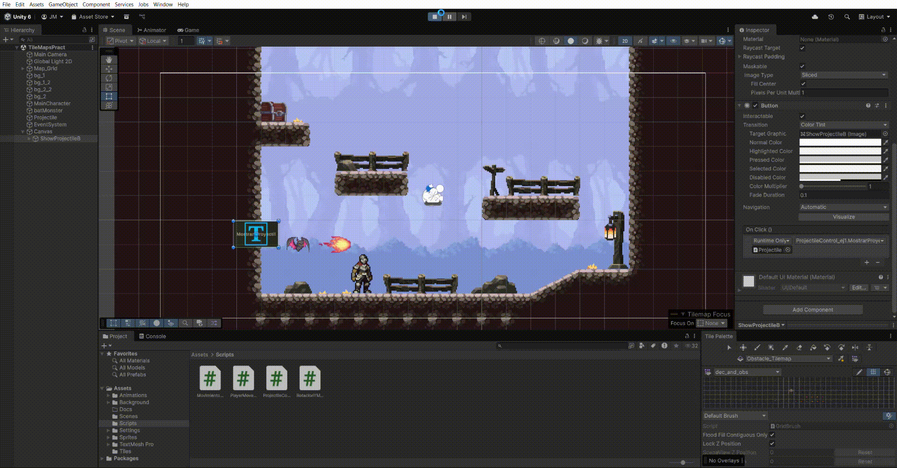
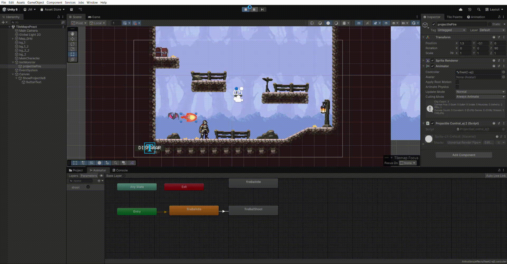
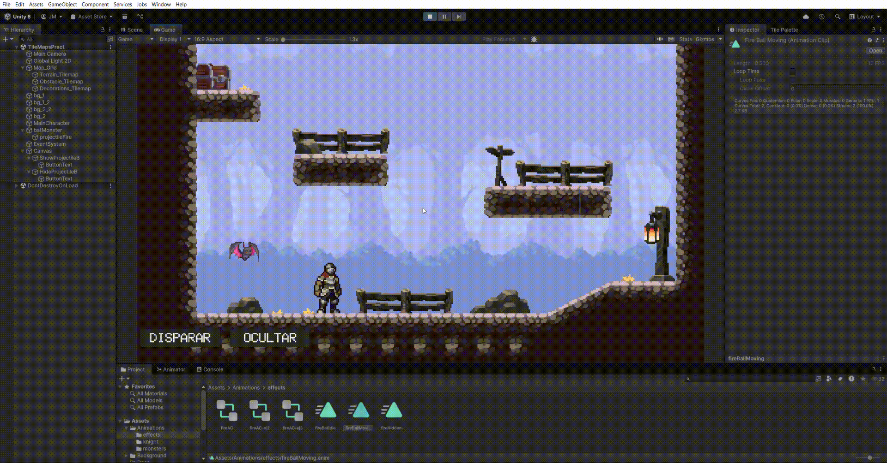
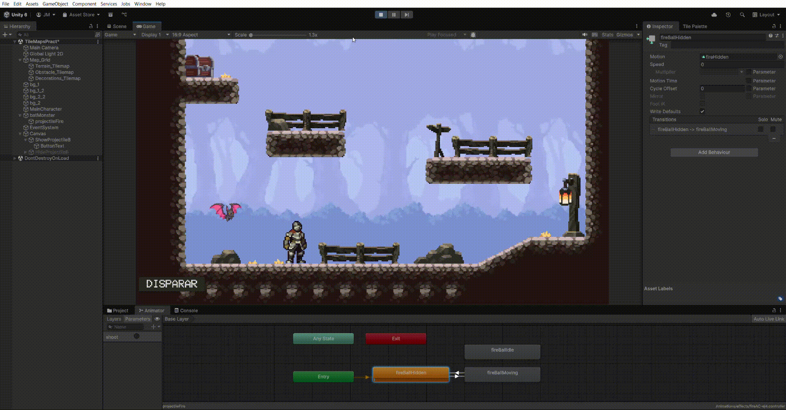
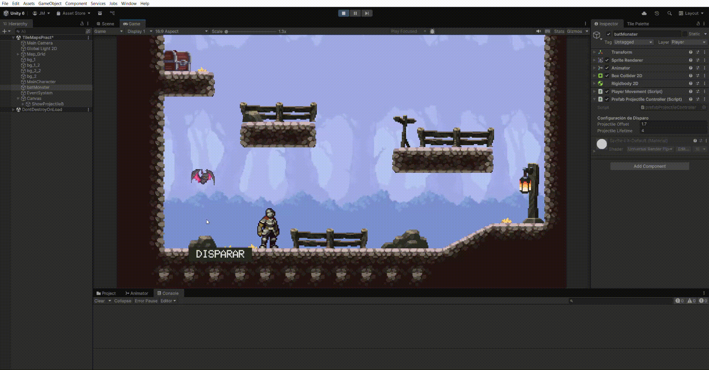

# FDV PRACTICA 5: UI y Eventos en Unity 2D

## Alumno
- Nombre: Jaime Madico Cañete
- ALU: alu0100895179
- Correo: alu0100895179@ull.edu.es

### Demostración de ejecución


## Entorno
- Unity 6.2: 6000.2.7f2
- Plataforma: Windows
- Input System: Unity New Input System (UnityEngine.InputSystem)
- Motor de físicas: 2D Physics Engine (Rigidbody2D, Collider2D)
- Tilemaps: Sistema de Unity (Grid, Tilemap, Tile Palette, Composite Collider 2D)
- Sistema de cámaras: Cinemachine (CinemachineBrain, CinemachineVirtualCamera, Confiner, TargetGroup, Impulse)
- Sistema UI: Unity UI (Canvas, Button, Toggle, Animator, UnityEvent)

## Resumen
En esta práctica se trabaja la gestión de UI y eventos en Unity 2D reutilizando el proyecto base de movimiento del jugador. El objetivo es familiarizarse con los eventos de UI (botones, toggles), el sistema de animadores y la comunicación entre componentes mediante eventos (UnityEvent / C# events). Se implementan proyectiles visibles/ocultables, animaciones por trigger, jerarquía de GameObjects (padre/hijo), ocultamiento automático, prefabs e instanciación, respuesta a notificaciones de colisiones y una UI para cambiar la velocidad de movimiento (turbo/normal).

Se entrega un repositorio GitHub con los scripts y gifs demostrativos, y un .zip del proyecto subido al campus virtual.

---

## Ficheros más importantes entregados

- PRACTICA.md  
- Scripts/
  - eventCollisionController
  - PlayerMovement.cs
  - prefabProjectileController.cs
  - ProjectileControl.cs
  - ProjectileControl_ej1.cs
  - ProjectileControl_ej2.cs
  - ProjectileControl_ej3.cs
  - ProjectileControl_ej4.cs

---

## Enunciado general de la práctica 

Reutilizar el proyecto Unity 2D trabajado previamente. Desarrollar una escena con varios personajes (uno controlado por teclado) e implementar la lógica y UI del guion: control de visibilidad de sprites mediante UI, activación de animaciones por triggers, jerarquía padre/hijo para proyectiles, ocultamiento automático tras tiempo o al terminar animación, creación de prefabs e instanciación, comunicación por eventos (cuando el jugador colisiona con un objeto se notifica a los escuchantes) y una UI para alternar la velocidad de movimiento (turbo/normal).

---

### Ejercicio 1: Sprite simple y visibilidad
*Crear un GameObject con un Sprite que usaremos como proyectil que se activará en el juego. Añadir un script que lo oculte al iniciar (SpriteRenderer.enabled = false). Añadir un botón en UI que active el sprite al pulsarlo.*

Para este ejercicio, he creado un script `ProjectileControl_ej1` que se añade directamente al `GameObject` del proyectil (de momento, un simple *sprite*).

El script primero obtiene la referencia al componente `SpriteRenderer` del objeto. En el método `Start()`, se utiliza esta referencia para deshabilitar el *renderer*, ocultando el sprite en cuanto se inicia el juego.

```csharp
public class ProjectileControl_ej1 : MonoBehaviour
{
    private SpriteRenderer sr;

    void Start()
    {
        sr = GetComponent<SpriteRenderer>();
        sr.enabled = false; // Ocultar al iniciar
    }
```
A continuación, se define un método público, MostrarProyectil(). Que sea público es esencial para que pueda ser llamado desde fuera del script, concretamente desde un componente de UI.

```csharp
public void MostrarProyectil()
    {
        sr.enabled = true; // Mostrar al pulsar el botón
    }
}
```
Finalmente, en la escena he añadido un `Canvas` con un `Button`. En el evento ***On Click ()*** de este botón, he arrastrado el objeto del proyectil y he seleccionado la función ***ProjectileControl_ej1.MostrarProyectil*** para que se ejecute al hacer clic.



---

### Ejercicio 2: Animación simple
*Crear un Animator en el GameObject con dos clips: Idle y Dispara, para ello crea un GameObject con el primer frame y agrega como hijos los restantes de la animación. Configurar un trigger Dispara y la transición Idle → Dispara. Modificar el script para que al pulsar el botón se dispare, la lógica del script debe activarlo para hacerlo visible y también activar la animación. Usa la función SetTrigger para activar este tipo de animación. El proyectil quedará en escena.*

Siguiendo el ejercicio anterior, he añadido un componente **`Animator`** al mismo `GameObject` del proyectil.

He creado un `Animator Controller` con dos estados (clips de animación): **`FireBallIdle`** (el estado por defecto) y **`FireBallShoot`** (la animación de la explosión). Tal como se ve en la captura, he definido un parámetro de tipo **`Trigger`** llamado "shoot".

He configurado una transición unidireccional desde `FireBallIdle` hacia `FireBallShoot`, que se activa únicamente cuando se dispara el *trigger* "shoot".

El script `ProjectileControl_ej2` se ha modificado para obtener también la referencia al `Animator`:

```csharp
public class ProjectileControl_ej2 : MonoBehaviour
{
    private SpriteRenderer sr;  // Renderer de mi proyectil
    private Animator anim;      // Referencia al componente Animator

    void Start()
    {
        // Obtenemos los componentes al iniciar
        sr = GetComponent<SpriteRenderer>();
        anim = GetComponent<Animator>();

        // Ocultamos el proyectil al empezar
        sr.enabled = false;
    }
```

La función pública `Shoot()` (anteriormente MostrarProyectil) ahora es responsable tanto de la visibilidad como de la animación. Esta función es la que se llama desde el evento `On Click ()` del botón de la UI.
```csharp
// Renombro la función para que sea más clara
    public void Shoot()
    {
        // 1. Hacemos visible el proyectil
        sr.enabled = true;

        // 2. Activamos el trigger "shoot" en el Animator
        anim.SetTrigger("shoot");
    }
}
```

Al pulsar el botón, el proyectil se hace visible (`sr.enabled = true`) e inmediatamente se activa el *Animator* mediante `anim.SetTrigger("shoot")`, iniciando la animación de disparo. Como no hay transición de retorno, el proyectil permanece en escena en el último frame de la animación.



---

### Ejercicio 3: Proyecto con hijos (jerarquía simple)
*Mueve el proyectil dentro del jugador (como hijo). Comprueba que su posición se mueve con el jugador automáticamente. Revisa tu script, si fuese necesario, para que no se oculte el personaje del jugador. Intenta ocultar el proyectil después de haberse disparado, para ello recupera el componente SpriteRenderer y pon su propiedad enabled a false. Observa si sólo se oculta el padre.*

En este paso, he modificado la jerarquía de la escena, tal como se ve en la captura de pantalla. El `GameObject` del proyectil (`projectilFire`) ahora es un **hijo** directo del `GameObject` del jugador (`batMonster`).

El resultado inmediato es que el `Transform` del proyectil se vuelve relativo al de su padre. Como he podido comprobar, al desplazar el sprite del jugador, lo hará también el proyectil, lo que confirma que el anidado funciona correctamente.

El script `ProjectileControl_ej3` (que está en el objeto hijo `projectilFire`) ya se encarga de gestionar la visibilidad del *renderer* del proyectil. Al ejecutarse en el objeto hijo, la línea `sr = GetComponent<SpriteRenderer>();` obtiene la referencia **solo** al `SpriteRenderer` del proyectil; y por lo tanto al poner `sr.enabled = false;` en el `Start()`, se oculta únicamente el proyectil (el hijo).

Para ocultar el proyectil después de haberse disparado, he usado un botón que llamará a una función para desactivar el *sprite renderer*:

1.  He añadido una nueva función pública al script anterior:
    ```csharp
    // Esta función será llamada por un Evento de Animación
    public void HideAfterAnimation()
    {
        sr.enabled = false; // Ocultar de nuevo al finalizar la animación
    }
    ```

2. He añadido un nuevo Botón a la UI con el texto "Ocultar".
3. En el evento `On Click ()` de este nuevo botón, he arrastrado el objeto del proyectil y he seleccionado la función `HideAfterAnimation()`.

De esta forma, el flujo es completo: el proyectil está oculto, el botón "Disparar" lo muestra e inicia la animación (Shoot()), y si pulso el botón "Ocultar", el proyectil se desactiva manualmente (`HideAfterAnimation()`).



---

### Ejercicio 4: Ocultamiento automático
*Oculta automáticamente los proyectiles después de un tiempo o al terminar la animación. Ajustar el trigger y la visibilidad para que todo funcione correctamente. Puedes usar corrutinas para parar la ejecución durante un tiempo establecido.*

Para este ejercicio, he modificado la lógica para que el proyectil se oculte automáticamente al finalizar su animación, eliminando la necesidad del botón "Ocultar".

La solución se ha implementado directamente en el **`Animator Controller`**.

1. He reemplazado el estado `FireBallIdle` por un nuevo estado llamado **`FireBallHidden`**. Este es ahora el estado por defecto (el que se conecta desde `Entry`), tal como se ve en la captura.
2. El clip de animación `FireBallHidden` está configurado para que deshabilite el `SpriteRenderer` (`sr.enabled = false`), asegurando que el objeto esté invisible en este estado.
3. He creado una nueva transición desde `FireBallMoving` (la animación de disparo) de vuelta a `FireBallHidden`.
4. Para que esta lógica funcione, es importante que la transición de retorno tiene marcada la casilla **`Has Exit Time`** activada. Esto provoca que, tan pronto como la animación `FireBallMoving` termine, el `Animator` automáticamente tome esa transición y regrese al estado `FireBallHidden`, ocultando el sprite.

El script `ProjectileControl_ej4` ahora es más sencillo, ya que no necesita una función de "ocultar". Su única responsabilidad es hacer visible el sprite y disparar el trigger:

```csharp
public class ProjectileControl_ej4 : MonoBehaviour
{
    private SpriteRenderer sr;  // Renderer de mi proyectil
    private Animator anim;      // Referencia al componente Animator

    void Start()
    {
        // Obtenemos los componentes al iniciar
        sr = GetComponent<SpriteRenderer>();
        anim = GetComponent<Animator>();

        // Ocultamos el proyectil al empezar
        // Aunque se podría obviar porque se está controlando desde el animator
        sr.enabled = false;
    }

    // Función de disparo del proyectil
    public void Shoot()
    {
        // 1. Hacemos visible el proyectil
        sr.enabled = true;

        // 2. Activamos el trigger "Dispara" en el Animator
        anim.SetTrigger("shoot");
    }
}
```
El flujo completo ahora es: el proyectil empieza *oculto* (en estado FireBallHidden). Al pulsar el botón "Disparar", el script lo hace visible (`sr.enabled = true`) y activa el **trigger** (`anim.SetTrigger("shoot")`). La animación `FireBallMoving` se reproduce, y al terminar, el **Animator** vuelve automáticamente al estado `FireBallHidden`, ocultando el sprite sin necesidad de más código o botones.



---

### Ejercicio 5 (opcional avanzado): Prefab e instanciación
*Transformar el proyectil en un prefab. Instáncialo desde el jugador al pulsar un botón, activa. Gestionar ocultamiento y destrucción automática.*

Para este ejercicio, he convertido el `GameObject` `projectilFire` en un **Prefab**.

#### Generación del Prefab

Partiendo del `projectilFire` del Ejercicio 4, el proceso fue:
1.  Crear una carpeta `Assets/Resources`.
2.  Arrastrar el `projectilFire` desde la `Hierarchy` (Jerarquía) a la carpeta `Resources`.
3.  Eliminar el `projectilFire` original de la escena, ya que ahora será instanciado.

#### Script de instanciación (en el 'Player')

He añadido un nuevo script, `PrefabProjectileController`, **al jugador**. Este script actúa como el "lanzador".

Sus partes clave son:

**1. Cargar el Prefab al inicio:**
En `Awake()`, cargamos el prefab desde la carpeta `Resources` para tenerlo listo.
```csharp
    private GameObject _projectilePrefab;

    void Awake()
    {
        // Cargamos el prefab desde la carpeta Resources al inicio
        _projectilePrefab = Resources.Load<GameObject>("projectileFire");
```
**2. Instanciar al disparar (Tecla F)**:
Se escucha desde el método `Update()` la pulsación de la tecla 'F' y llamar al método de disparo:`if (Keyboard.current.fKey.wasPressedThisFrame) Shoot();`

**3. Lógica del método de disparo:**
El método `Shoot()` crea el proyectil, lo posiciona en una distancia relativa al jugador, programa su destrucción y lo activa.
```csharp
void Shoot()
    {
        if (_projectilePrefab == null) return;

        // 1. INSTANCIAMOS EL PROYECTIL Y LO HACEMOS HIJO DIRECTAMENTE
        GameObject projectileInstance = Instantiate(_projectilePrefab, transform);

        // 2. LE DAMOS UNA POSICIÓN LOCAL (relativa al padre)
        projectileInstance.transform.localPosition = new Vector3(projectileOffset, 0, 0);
        
        // 3. PROGRAMAMOS SU DESTRUCCIÓN
        Destroy(projectileInstance, projectileLifetime);
        
        // 4. LE DAMOS LA ORDEN DE ACTIVAR LA ANIMACIÓN
        ProjectileControl projectileScript = projectileInstance.GetComponent<ProjectileControl>();
        if (projectileScript != null)
        {
            projectileScript.ShootProjectile();
        }
    }
```

#### Script del Prefab (ProjectileControl.cs)
Este es el script (basado en el del Ejercicio 4) que va dentro del Prefab projectilFire. Su única misión es recibir la orden de "disparar" y gestionar su propia animación.
```csharp
    void Awake()
    {
        // ... (Obtenemos componentes, nos aseguramos de estar ocultos) ...
        sr = GetComponent<SpriteRenderer>();
        anim = GetComponent<Animator>();
        sr.enabled = false;
    }

    // Esta es la función que llama el jugador (PrefabProjectileController)
    public void ShootProjectile()
    {
        // 1. Hacemos visible el proyectil
        sr.enabled = true;

        // 2. Activamos el trigger "shoot" en el Animator
        anim.SetTrigger("shoot");
```
Con esta configuración, el "Jugador" (`PrefabProjectileController`) crea el proyectil, y el proyectil (`ProjectileControl`) gestiona su propia animación de disparo y ocultamiento automático (definido en el `Animator` en el Ejercicio 4), antes de ser finalmente destruido por el `Destroy`.



---

### Ejercicio 6 (opcional avanzado): Eventos
*Activa el proyectil en respuesta a una notificación del jugador. Cuando el jugador colisiona con un objeto predeterminado, debe activar el mensaje, y el objeto proyectil estar a la escucha, ahora no será click quien lo active.*

Para este ejercicio, he implementado un sistema de **`UnityEngine.Events`** (Eventos de Unity). Esta librería permite crear un evento público en un script y conectarlo a funciones de otros scripts visualmente, a través del Inspector, en el gif de demostración se puede observar esta asociación.

He dividido la lógica en dos scripts principales, ambos situados en el `Player`:

#### 1. El emisor (Publisher)
Este script, `eventCollsionController`, se encarga de detectar la colisión. Al chocar con un objeto con el *Tag* `ShootTagEvent`, "lanza" un evento público.

* Es necesario incluir la librería: `using UnityEngine.Events;`
* Se define el evento público que será visible en el Inspector:
    ```csharp
    [Header("Evento de Unity")]
    public UnityEvent OnShootEventTriggered; // Evento público
    ```
* En la colisión, se invoca el evento (avisando a todos los suscriptores):
    ```csharp
    private void OnCollisionEnter2D(Collision2D collision)
    {
        if (collision.gameObject.CompareTag("ShootTagEvent"))
        {
            // Lanzamos el evento
            OnShootEventTriggered?.Invoke();
            // Para hacerlo más "vistoso", programo la destrucción del objeto que choca.
            Destroy(collision.gameObject);
        }
    }
    ```

#### 2. El suscriptor (Subscriber)
Este será el script generado en el paso anterior: `PrefabProjectileController`. Su método `Shoot()` ya es público, por lo quepodemos asociarlo para ser llamado por un evento.

A diferencia del método `System.Action`, este script **no necesita** los métodos `OnEnable` u `OnDisable` para suscribirse, ya que la conexión se realiza en el Inspector.

1. Desde el inspector en el actor que controla `eventCollsionController`, he buscado el **evento**: **`On Shoot Event Triggered ()`**.
2. He pulsado el **+** para añadir un **listener (oyente)**.
3. He arrastrado el mismo objeto del `Player` a la ranura `None (Object)`.
4. En el desplegable de funciones, he seleccionado **`PrefabProjectileController -> Shoot ()`**.

De esta forma, cuando el `eventCollsionController` detecta la colisión e invoca el evento, el Inspector llama automáticamente a la función `Shoot()` del `PrefabProjectileController`, creando el proyectil.


---

### Ejercicio 7: UI Turbo
*Implementa una UI que permita conmutar con qué velocidad te moverás: turbo o normal.*

Para esta tarea, he implementado un componente UI de tipo **`Toggle`** (Interruptor), que permite al usuario activar o desactivar un "Modo Turbo".

La lógica principal reside en el script de movimiento del jugador (`PlayerMovement`, añadido a `MainCharacter`), donde he definido dos velocidades (`normalSpeed` y `turboSpeed`) y he creado una función pública diseñada específicamente para la UI.

Esta función, `SetTurboMode(bool isTurboOn)`, es la que lo hace posible. Recibe el estado actual del `Toggle` (un booleano que es `true` si está marcado, `false` si no) y actualiza la variable `speed` del jugador en consecuencia.

```csharp
    // Recibe 'true' si el Toggle está activado, y 'false' si está desactivado
    public void SetTurboMode(bool isTurboOn)
    {
        if (isTurboOn)
        {
            speed = turboSpeed;
            Debug.Log("Modo Turbo ACTIVADO");
        }
        else
        {
            speed = normalSpeed;
            Debug.Log("Modo Turbo DESACTIVADO");
        }
    }
```
La conexión se realiza en el Inspector del "Toggle". He utilizado el evento `On Value Changed (Boolean)`:
1. He arrastrado el `GameObject` del jugador (`MainCharacter`) a la ranura del evento.
2. He seleccionado la función pública que acabamos de crear: `PlayerMovement.SetTurboMode`.

De esta forma, cada vez que se hace clic en el `Toggle`, su estado (`true` o `false`) se envía automáticamente a esta función, cambiando la velocidad del jugador en tiempo real.

