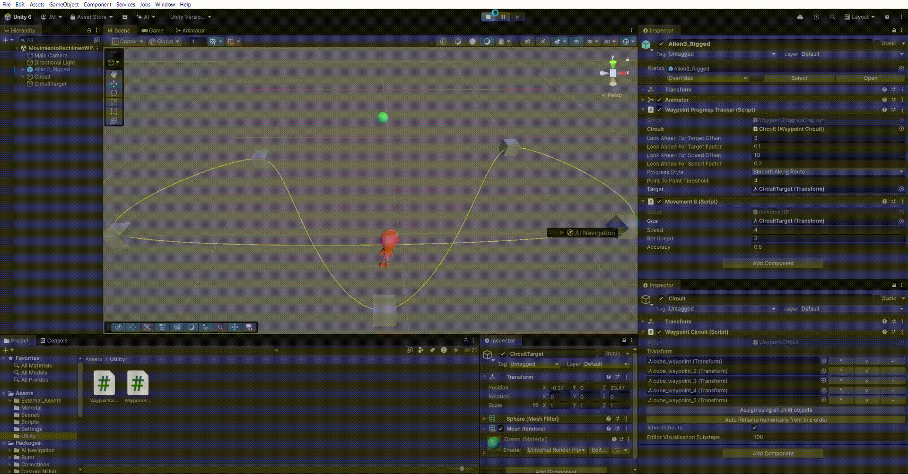
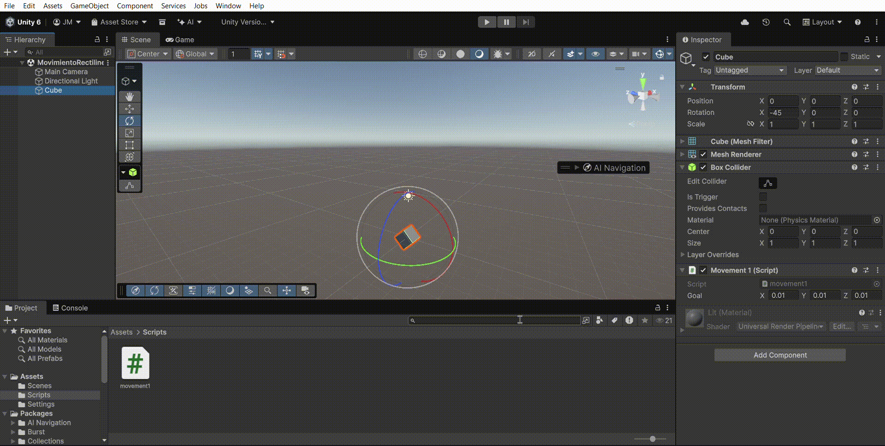
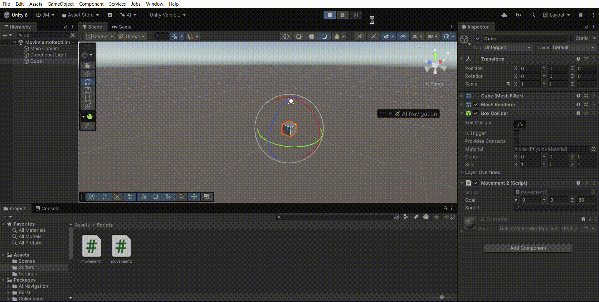
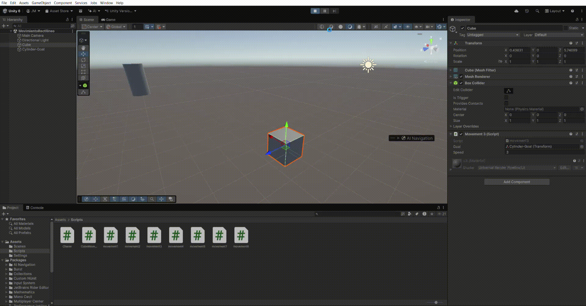
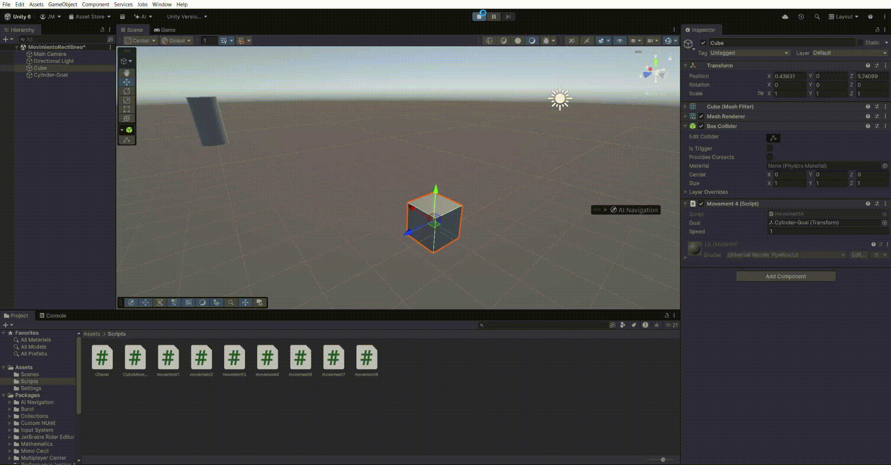
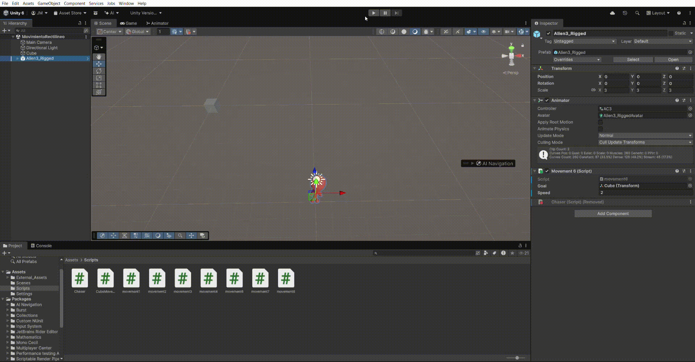
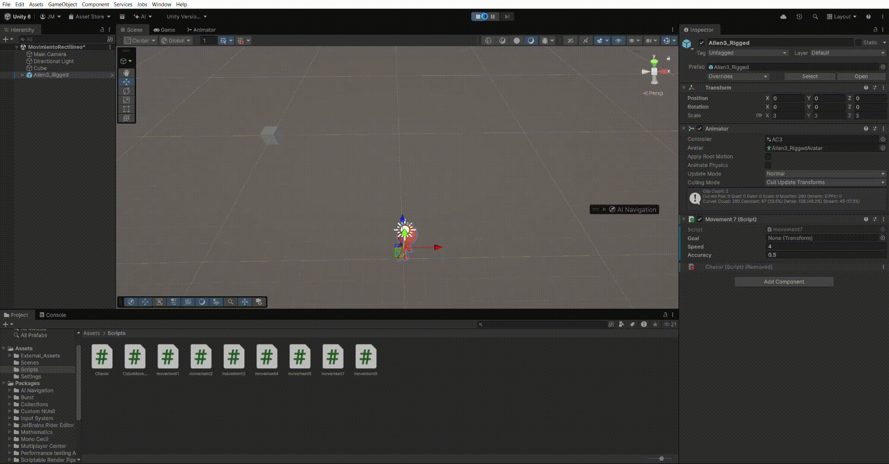
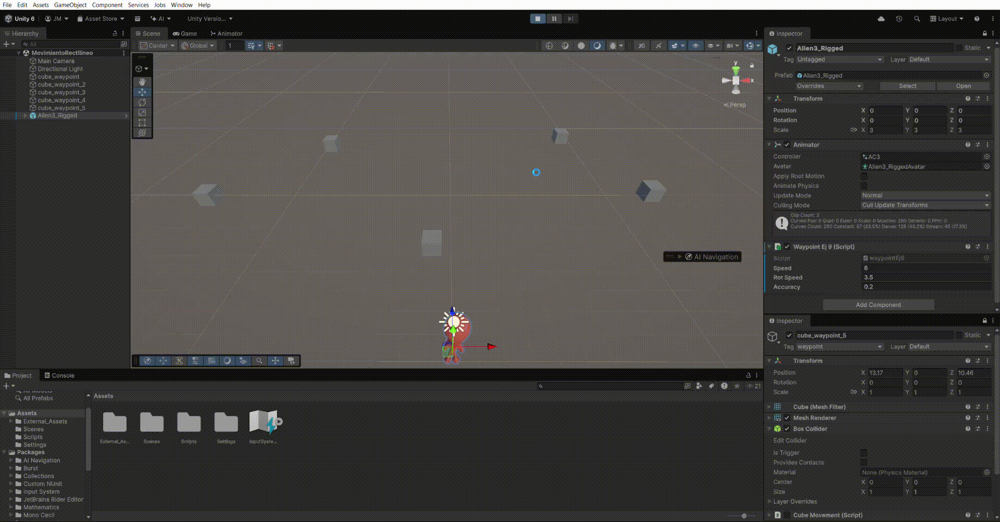

# FDV PRÁCTICA 8: Movimiento 3D, Vectores y Sistemas de Navegación

## Alumno
- Nombre: Jaime Madico Cañete
- ALU: alu0100895179
- Correo: alu0100895179@ull.edu.es

### Demostración de ejecución


## Entorno
- Unity Version: 6.3 - 6000.3.2f1
- Plataforma: Windows 
- Sistema de coordenadas: 3D (Left-handed)
- Input System: Unity New Input System (UnityEngine.InputSystem)
- Componentes clave: Transform, LookAt, Vector3, Quaternion
- Assets externos: Personaje para las pruebas ("Alien3_Rigged") y scripts de *Waypoints* (Utility) 
- Control de versiones: Git (repositorio en GitHub)  
- Entrega: Repositorio + GIF demostrativo + .zip en Campus Virtual

## Resumen
En esta práctica se exploran los fundamentos matemáticos y prácticos del movimiento de objetos en un espacio tridimensional dentro de Unity. El objetivo es comprender la diferencia entre sistemas de referencia locales y de mundo, el uso de vectores para calcular direcciones y distancias, y la aplicación de rotaciones tanto instantáneas como suavizadas.

Se comienza implementando scripts básicos para desplazar un personaje hacia un objetivo utilizando su vector `forward` y calculando vectores de dirección manuales. Se aborda la importancia de la **normalización** de vectores para mantener una velocidad constante independiente de la distancia.

Un punto crítico de la práctica es la solución del problema de **Jittering** (vibración al llegar al destino), implementando umbrales de precisión (`accuracy`) basados en la magnitud del vector dirección o la distancia entre puntos.

Posteriormente, se mejora la calidad visual del movimiento sustituyendo rotaciones bruscas (`LookAt`) por rotaciones interpoladas mediante `Slerp` (*Spherical Linear Interpolation*) usando Cuaterniones.

Finalmente, se implementan sistemas de navegación automática: primero, un sistema de **Waypoints** (puntos de ruta) básico con lógica propia; y segundo, la integración del sistema de **Waypoints de los `Standard Assets de Unity`** (`WaypointCircuit` y `WaypointProgressTracker`) para lograr un comportamiento de persecución fluido.

---

## Ficheros más importantes entregados

- PRACTICA.md
- Assets/
  - Utility/
    - WaypointCircuit.cs
    - WaypointCircuit.meta
    - WaypointProgressTracker.cs
    - WaypointProgressTracker.meta
  - Scripts/
    - Chaser.cs.meta
    - CubeMovement.cs
    - CubeMovement.cs.meta
    - movement1.cs
    - movement1.cs.meta
    - movement2.cs
    - movement2.cs.meta
    - movement3.cs
    - movement3.cs.meta
    - movement4.cs
    - movement4.cs.meta
    - movement6.cs
    - movement6.cs.meta
    - movement7.cs
    - movement7.cs.meta
    - movement8.cs
    - movement8.cs.meta
    - waypointEj9.cs
    - waypointEj9.cs.meta
  - Scenes/
    - MovimientoRectilineoWP.unity
    - MovimientoRectilineoWP2.unity

---

## Enunciado general de la práctica

Seguir el guión sobre movimiento rectilíneo y hacer los ejercicios.

El objetivo es programar el comportamiento de movimiento de un personaje hacia un objetivo en un entorno 3D. Se debe progresar desde movimientos básicos y bruscos hasta movimientos suaves y precisos. Finalmente, se debe aplicar este conocimiento para hacer que el personaje recorra un circuito predefinido.

Objetivos concretos:
- Tarea 1: Movimiento básico con Translate.
- Tarea 2: Normalización y consistencia temporal (DeltaTime).
- Tarea 3: Movimiento hacia una posición del mundo (Space.World).
- Tarea 4: Depuración visual del vector dirección.
- Tarea 5: Persecución dinámica y control de velocidad.
- Tarea 6: Sistemas de referencia (Space.Self vs. Space.World).
- Tarea 7: Control del "Jittering" (Vibración).
- Tarea 8: Rotación suave con "Slerp" (Interpolación).
- Tarea 9: Sistema básico de Waypoints.
- Tarea 10: Sistema de Waypoints avanzado (Unity Standard Assets).

---

### Tarea 1: Movimiento básico con Translate

En este primer ejercicio exploramos el método `transform.Translate(Vector3 translation)`. Es fundamental entender que el parámetro que pasamos no es una "posición de destino" (un punto en el mapa), sino un **vector de desplazamiento** (cuánto me muevo desde donde estoy). Para ello coloco un objeto tridimensional en la escena (una esfera) y aplico desplazamientos de las diferentes maneras mencionadas en el enunciado.


#### *Enunciado: Utilizar this.transform.Translate(goal) en el start, solo se mueve una vez.*

- **Configuración:**
```csharp
using UnityEngine;

public class movement1 : MonoBehaviour
{
    
    // Representa el vector al destino que queremos alcanzar
    public Vector3 goal = new Vector3(0, 0, 2.0f);

    void Start()
    {
        // El objeto se "teletransporta" una sola vez al iniciar.
        this.transform.Translate(goal);
    }

}
```
- **Observación:** El objeto se desplaza instantáneamente una única vez al pulsar `Play`. No hay animación de movimiento, es un "salto" discreto de posición igual al valor del vector *goal*.
- **Conclusión:** Start solo sirve para posicionamiento inicial, no para movimiento continuo.


#### *Enunciado A: Añadir this.transform.Translate(goal); al Update e ir multiplicando goal = goal * 0.5f; en el start para dar saltos más pequeños cada vez*

- **Configuración:**
```csharp

    // Variable pública para manipular en el Inspector (X, Y, Z)
    public Vector3 goal = new Vector3(0, 0, 0.1f);

    void Start()
    {
        // --- OPCION A ---
        goal = goal * 0.5f;
    }

    void Update()
    {
        // OPCIÓN A: Moverse continuamente
        // Al ejecutarse en cada frame, el vector 'goal' se suma continuamente a la posición.
        this.transform.Translate(goal);
    }
```

- **Observación:** El objeto se mueve de forma continua. Al multiplicar por 0.5f, el objeto se mueve visualmente más lento (exactamente a la mitad de velocidad).

- **Conclusión:** En *Update*, el vector goal define cuánto avanza el objeto por frame. Reducir la magnitud del vector reduce la velocidad del movimiento.


#### *Enunciado B: Coordenada Y de 'goal' en 0*

- **Configuración:** `goal = (X, 0, Z)`.

- **Observación:** El objeto se desplaza deslizándose paralelamente al plano del suelo (XZ). No gana ni pierde altura.

- **Conclusión:** Al anular el componente Y del vector, restringimos el movimiento al plano horizontal.


#### *Enunciado C: Coordenada Y de 'goal' distinta de 0*

- **Configuración:** goal = (0, 1, 1) (por ejemplo).

- **Observación:** El objeto asciende en diagonal mientras avanza.

- **Conclusión:** El movimiento es la suma vectorial de sus componentes. Translate acumula desplazamiento en todos los ejes que tengan valor.


#### *Enunciado D: Simulación de avión*

- **Configuración:** Para esta prueba decido cambiar el objeto de la escena, en vez de una esfera utilizo un cubo que nos permite notar mejor la orientación del objeto. Decido rotarlo `45º` en el eje X. Tras esto puedo avanzar directamente en el `Forward` del objeto y usar nuevamente `Translate(0, 0, 0.1f)`.

- **Observación:** El objeto avanza en la dirección de `Forward`", que, como está orientando, se eleva respecto al suelo.

- **Conclusión:** Por defecto, `Translate` utiliza `Space.Self` (sistema de referencia local). Si el objeto rota, su eje Z ("forward") rota con él.


#### *Enunciado E: Duplicar valores X, Y, Z*

- **Configuración:** En lugar de cambiar los valores en el Inspector, modifico la instrucción en el `Update` para multiplicar el vector al vuelo: `this.transform.Translate(goal * 2.0f);`.

- **Observación:** El objeto se mueve al doble de velocidad de forma constante. Solo estamos duplicando el desplazamiento resultante para cada frame, manteniendo la variable original intacta.

- **Conclusión:** El movimiento sigue siendo consistente y lineal. Esto demuestra que la velocidad de traslación es directamente proporcional a la magnitud del vector pasado a la función `Translate`. En cambio, si lo hubiéramos hecho de este modo: `goal = goal * 2` dentro del bucle de `Update`, causaría una aceleración exponencial, tan "explosiva" que no alcanzaríamos a ver el movimiento del objeto.



---

### Tarea 2: Normalización y consistencia temporal (DeltaTime)

En este ejercicio refinamos el movimiento para que sea independiente de la magnitud del vector dirección y de la velocidad de ejecución (FPS) del ordenador. Partimos de un vector `goal` que define la dirección deseada.

#### *Enunciado A: Sustituir la dirección del movimiento por su equivalente normalizada.*

- **Configuración:**
```csharp
void Update(){
    this.transform.Translate(goal.normalized);
}
```
- **Conclusiones:** Usar goal.normalized convierte cualquier vector en un "Unitario" (magnitud 1) conservando su dirección. El objeto se mueve exactamente 1 unidad por frame, independientemente de los valores de "goal".


#### *Enunciado B: Con el vector normalizado, lo podemos multiplicar por un valor de velocidad para determinar cómo de rápido va el personaje.*

- **Configuración:**
```csharp
public float speed = 0.1f;
void Update(){
    this.transform.Translate(goal.normalized * speed);
}
```

- **Conclusiones:**
Si solo normalizamos el vector, conseguiremos desplazarnos 1 unidad por frame, que es una velocidad fija. Al mutiplicarlo por un valor configurable (`public float speed`) ganamos control de la velocidad del movimiento.


#### *Enunciado C: Suavizar el movimiento ya que depende de la velocidad a la que se produzca el update*

- **Configuración:**
```csharp
public float speed = 0.1f;
void Update(){
    this.transform.Translate(goal.normalized * speed * Time.deltaTime);
}
```

- **Conclusiones:**
Como adelantaba el enunciado, si solo multiplicamos por "speed" se pueden producir inconsistencias espacio-temporales (la velocidad de desplazamiento depende de la velocidad entre "frames"). Para controlar y estabilizar este movimiento se debe multiplicar por `Time.deltaTime` (el tiempo en segundos que tardó en renderizarse el último frame). Convertimos la velocidad de "unidades/frame" a "unidades/segundo". De esta manera la velocidad de desplazamiento es completamente estable.



---

### Tarea 3: Movimiento hacia una posición del mundo (Space.World)

En este ejercicio abandonamos los vectores abstractos y hacemos que el personaje persiga a un objeto real de la escena (`Transform goal`). Calculamos el vector necesario restando la posición del destino menos la del origen. Además, solucionamos el conflicto entre la orientación del personaje y su desplazamiento.

#### *Enunciado A: Hacemos el objetivo una variable pública public Transform goal y añadimos un public float speed = 1.0f.* 

- **Configuración:**
```csharp
public Transform goal;
public float speed = 1.0f;
```

- **Conclusiones:** Al cambiar el tipo de variable a `Transform`, ya no introducimos coordenadas a mano, sino que podemos arrastrar cualquier objeto de la escena (un cubo, una esfera, etc.) al inspector para que sea nuestro objetivo. La variable `speed` nos permite ajustar la velocidad de persecución.


#### *Enunciado B: Giramos al personaje para lograr que su movimiento sea hacia delante utilizando "LookAt" para que gire primero y luego se mueva.* 

- **Configuración:**
```csharp
void Start() {
    this.transform.LookAt(goal.position);
}
```

- **Conclusiones:** Usamos `LookAt` en el `Start` para orientar al personaje hacia el objetivo. Con esto conseguimos que, visualmente, el eje Z (**"forward"**) del personaje apunte directamente hacia el destino. Sin embargo, esto solo afecta a la rotación; el personaje todavía no se desplaza, solo se ha encarado para "mirar" a donde quiere ir.


#### *Enunciado C: La dirección en la que nos tenemos que mover viene determinada por la diferencia entre la posición del objetivo y nuestra posición.* 

- **Configuración:**
```csharp
void Update() {
    Vector3 direction = goal.position - this.transform.position;
    this.transform.Translate(direction.normalized * speed * Time.deltaTime);
}
```

- **Conclusiones:** Calculamos la dirección matemática restando la posición del objetivo menos la nuestra (**goal - position**). Al aplicar este vector con un `Translate` directamente, el objeto se desplaza erróneamente ya que intenta aplicar coordenadas de mundo sobre sus ejes locales (que rotamos en el apartado B).

- **Corrección:** La solución es añadir el parámetro `Space.World`, forzando a que el desplazamiento ignore la rotación del personaje y use los ejes globales, logrando que el personaje avance exactamente por la línea que lo une al objetivo.



---

### Tarea 4: Depuración visual del vector dirección

Para verificar que nuestros cálculos matemáticos son correctos sin necesidad de esperar a ver si el objeto se mueve bien o mal, utilizamos herramientas de depuración visual que dibujan los vectores en la escena.

#### *Enunciado: Añadir Debug.DrawRay para comprobar que la dirección está correctamente calculada.*

- **Configuración:** `Debug.DrawRay(this.transform.position, direction, Color.red);`
- **Conclusiones:** Al añadir esta línea, vemos aparecer una línea roja en la vista de **Escena (Scene)** que conecta el centro del personaje con el centro del objetivo. Esto nos confirma visualmente que el cálculo `goal - position` es correcto:



---

### Tarea 5: Persecución dinámica y control de velocidad

En este ejercicio aumentamos la complejidad haciendo que el objetivo (`Target`) ya no sea estático, sino que se mueva controlado por el usuario. El personaje deberá recalcular su trayectoria en cada frame para interceptarlo. Además, introducimos interacción en tiempo real para modificar la velocidad de persecución.

En primer lugar, creamos un script simple para el Cubo que lea los ejes de entrada horizontal y vertical.

- **Configuración (Script `CubeMovement.cs`):**
```csharp
// Inicializamos las variables de desplazamiento en 0
float h = 0;
float v = 0;

// Verificamos si existe un teclado conectado
if (Keyboard.current != null)
{
    // Calculamos "Lateral" manualmente
    if (Keyboard.current.dKey.isPressed || Keyboard.current.rightArrowKey.isPressed) 
        h += 1f;
    
    if (Keyboard.current.aKey.isPressed || Keyboard.current.leftArrowKey.isPressed) 
        h -= 1f;


    // Calculamos "Forward" manualmente
    if (Keyboard.current.wKey.isPressed || Keyboard.current.upArrowKey.isPressed) 
        v += 1f;

    if (Keyboard.current.sKey.isPressed || Keyboard.current.downArrowKey.isPressed) 
        v -= 1f;

    // Movemos el cubo en sus ejes X y Z locales
    Vector3 movement = new Vector3(h, 0, v);
    this.transform.Translate(movement.normalized * cubeSpeed * Time.deltaTime);
}
```


#### *Enunciado A: Crear un script que haga que el personaje siga al cubo continuamente sin aplicar simulación física.*

- **Configuración (Script `Chaser.cs`):**
```csharp
public class Chaser : MonoBehaviour
{
    public Transform goal; 
    private float speed = 1.0f;

    void Update()
    {
        if (goal == null) return;

        // Mirar al objetivo
        this.transform.LookAt(goal.position);

        // Recalcular dirección hacia la nueva posición del cubo
        Vector3 direction = goal.position - this.transform.position;

        // Moverse hacia él (Space.World para tener en cuenta coordenadas del mundo)
        this.transform.Translate(direction.normalized * speed * Time.deltaTime, Space.World);
    }
}
```

- **Conclusiones:** A diferencia de moverse hacia un punto fijo, aquí el vector `direction` es dinámico. Al calcular `target.position - this.transform.position` dentro del bucle `Update`, el personaje "persigue" al objetivo en tiempo real.

#### *Enunciado B: Agregar un campo público que permita graduar la velocidad del movimiento desde el inspector de objetos.*

- **Configuración (Script `Chaser.cs`):**
```csharp
// Campo público para ajustar velocidad en el Inspector
[Range(1f, 20f)] // Añade un slider en el editor
public float speed = 3.0f;
```

- **Conclusiones:** Al declarar la variable `speed` como `public`, Unity la expone automáticamente en el `Inspector`. Esto nos permite ajustar el comportamiento del juego en tiempo de ejecución. Además al utilizar el `slider` logramos que la operación sea mucho más rápida y cómoda.

#### *Enunciado C: Utilizar la tecla de espaciado para incrementar la velocidad del desplazamiento en el tiempo de juego.*

- **Configuración (Script `Chaser.cs`):**
```csharp
public float turboMultiplier = 2.0f; // Cuánto aumenta la velocidad (x2)

void Update(){
    ...
    // C: Lógica de la velocidad mediante tecla "espacio"
    float currentSpeed = speed;
    if (Keyboard.current != null && Keyboard.current.spaceKey.isPressed)
    {
        // Aplicamos el multiplicador temporalmente
        currentSpeed = speed * turboMultiplier;
        Debug.Log("Tecla ESPACIO pulsada: ¡APLICANDO TURBO!");
    }
    ...
}
```

- **Conclusiones:** Para implementar esta mecánica de forma segura, utilizamos una variable local `currentSpeed` dentro del `Update`. Si detectamos el input (`spaceKey.isPressed`), modificamos esta variable local multiplicándola por el factor de turbo. Nunca modificamos la variable pública speed directamente (ej. speed *= 2), ya que eso alteraría el valor base permanentemente y causaría una aceleración acumulativa.


---

### Tarea 6: Sistemas de referencia (Space.Self vs. Space.World)

El objetivo es implementar el movimiento rectilíneo de un personaje hacia un destino, orientándolo y desplazándolo frontalmente. Se diferenciará entre aplicar el movimiento respecto al sistema local o al mundial (`Space.World`) para asegurar una trayectoria correcta, incluso si el personaje se encuentra, por ejemplo, dentro de un vehículo en movimiento.

#### *Enunciado A: Realizar un script que gire al personaje hacia su objetivo para llegar hasta él desplazándose sobre su vector forward local.*

Esta es la forma más intuitiva de mover un personaje (como un coche o una persona): primero giras y luego caminas recto.

- **Configuración:**
```csharp
// Orientamos el personaje hacia el objetivo:
this.transform.LookAt(goal.position);

// Nos movemos en su eje "Forward" (Z local)
// Al no especificar 'relativeTo', por defecto es Space.Self
this.transform.Translate(Vector3.forward * speed * Time.deltaTime);
```

- **Conclusiones:** Al usar `Vector3.forward`, equivalente a: `(0, 0, 1)`, estamos moviendo 1 unidad en el eje 'Z'. Como `Translate` funciona por defecto en `Space.Self` y previamente hemos rotado el objeto con `LookAt`, su eje 'Z' local apunta al objetivo. El movimiento es el deseado y simula el comportamiento natural de avanzar.


#### *Enunciado B: Realizar un script que gire al personaje y lo desplace hacia su objetivo sobre la dirección que lo une con su objetivo.*

Aquí intentamos mezclar los dos conceptos: rotar el personaje (`LookAt`) pero moverlo usando el vector de dirección calculado (`Destino - Origen`).
```csharp
void Update()
{
    // Orientamos el personaje
    this.transform.LookAt(goal.position);

    // Calculamos el vector dirección (Global)
    Vector3 direction = goal.position - this.transform.position;

    // Aplicamos el movimiento sin especificar espacio (Por defecto: Space.Self)
    this.transform.Translate(direction.normalized * speed * Time.deltaTime);
}
```

- **Conclusiones:**  Este experimento falla. El vector `direction` está calculado en coordenadas del mundo. Pero como usamos `Translate` sin `Space.World`, Unity intenta aplicar el movimiento relativo a la rotación del personaje. No se deben aplicar vectores calculados globalmente sobre transformaciones locales rotadas.


#### *Enunciado C: Desplazar hacia su objetivo en la dirección que lo une con él, respecto al sistema de referencia mundial.*

Corregimos el problema anterior indicando explícitamente el sistema de referencia del mundo.
```csharp
void Update()
{
    // Orientamos el personaje
    this.transform.LookAt(goal.position);

    // Calculamos el vector dirección (Global)
    Vector3 direction = goal.position - this.transform.position;

    // Movemos respecto al MUNDO
    this.transform.Translate(direction.normalized * speed * Time.deltaTime, Space.World);
}
```

- **Conclusiones:**  Al añadir `Space.World`, el movimiento ignora la rotación del personaje y aplica el vector `direction` directamente sobre las coordenadas de la escena. El `LookAt` solo afecta a la orientación visual, mientras que el `Translate` asegura que el objeto llegue matemáticamente al destino. Podemos concluir que esta es la forma más robusta de mover objetos cuando la orientación y la trayectoria se calculan por separado.



---

### Tarea 7: Control del "Jittering" (Vibración)

Cuando el personaje intenta llegar a la posición exacta del objetivo, se produce una oscilación continua denominada **Jittering**. Esto ocurre porque en un frame el personaje se pasa ligeramente del objetivo, al siguiente frame intenta volver, se vuelve a pasar, y entra en un bucle infinito de micro-correcciones. Para solucionarlo, definimos un margen de error o "zona de parada" (`accuracy`).

#### *Enunciado A: Controlar el jittering utilizando la magnitud de la dirección.*

La propiedad `.magnitude` de un vector nos devuelve la longitud total de ese vector. Si el vector dirección se calcula como `Destino - Origen`, su magnitud es exactamente la distancia que nos falta por recorrer.

- **Configuración:**
```csharp
public float accuracy = 0.5f; // Umbral para la detención

void Update()
{
    // Calcular el vector de dirección hacia el objetivo
    Vector3 direction = goal.position - this.transform.position;
    
    // Si la longitud del vector (distancia restante) es mayor que el umbral definido realizaremos la parada
    if (direction.magnitude > accuracy)
    {
        // Orientar hacia el objetivo
        this.transform.LookAt(goal.position);
        
        // Realizar el movimiento ya que seguimos lo suficientemente "lejos"
        this.transform.Translate(direction.normalized * speed * Time.deltaTime, Space.World);
    }
}
```

- **Conclusiones:** Al envolver el `Translate` en un condicional `if (magnitude > accuracy)`, el personaje deja de calcular y aplicar movimiento cuando está "lo suficientemente cerca". Esto **elimina el jittering**. *Nota sobre velocidad alta*: El enunciado advierte que con velocidades muy altas aún podría haber problemas. Esto sucede si el desplazamiento en un solo frame (`speed * deltaTime`) es mayor que el valor de `accuracy`. En ese caso, el personaje podría "saltarse" la zona de parada en un solo frame y quedar al otro lado, volviendo a intentar corregir.


#### *Enunciado B: Controlar el jittering utilizando la distancia entre los dos puntos.*

Alternativamente, Unity ofrece un método estático en la clase `Vector3` para calcular la distancia sin necesidad de acceder a la magnitud del vector dirección manualmente.
- **Configuración:**
```csharp
void Update()
{
    // Calcula la distancia absoluta entre los puntos
    if (Vector3.Distance(this.transform.position, goal.position) > accuracy)
    {
            // Recalculamos direction aquí dentro para movernos
            Vector3 direction = goal.position - this.transform.position;
            this.transform.LookAt(goal.position);
            this.transform.Translate(direction.normalized * speed * Time.deltaTime, Space.World);
    }
}
```

- **Conclusiones:** El método `Vector3.Distance(a, b)` devuelve exactamente el mismo valor que `(a - b).magnitude`. Usar este método hace el código más semántico ("Si la distancia es mayor que la precisión..."), mientras que usar la magnitud es más matemático. El resultado en el comportamiento del personaje es idéntico: se detiene suavemente antes de chocar o traspasar el objetivo.



---

### Tarea 8: Rotación suave con "Slerp" (Interpolación)

Hasta ahora, el método `LookAt` provocaba que el personaje se encarase instantáneamente hacia el objetivo en un solo frame. Esto genera movimientos robóticos y poco realistas. Para solucionarlo, utilizamos la **Interpolación Lineal Esférica (Slerp)**.

Un **Quaternion** es la estructura matemática que usa Unity para calcular rotaciones evitando el problema del *Gimbal Lock* (bloqueo de ejes) que sufren los ángulos de Euler tradicionales. Debemos calcular la rotación objetivo y, en lugar de aplicarla directamente, ir acercándonos a ella frame a frame.

- **Configuración:**
```csharp
public float rotSpeed = 2.0f; // Velocidad de giro 

// Calcular LA ROTACIÓN necesaria para mirar en esa dirección
// LookRotation convierte un Vector3 (dirección) en un Quaternion (rotación)
Quaternion targetRotation = Quaternion.LookRotation(direction);

// INTERPOLAR (SLERP): Vamos desde mi rotación actual (transform.rotation) hacia la rotación deseada (targetRotation)
this.transform.rotation = Quaternion.Slerp(this.transform.rotation, targetRotation, rotSpeed * Time.deltaTime);
```
- **Conclusiones:** Al usar `Quaternion.Slerp`, el personaje gira gradualmente. La variable `rotSpeed` controla cuán rápido encara al objetivo, mientras que `speed` controla el avance. Con esto logramos curvas de movimiento naturales: el personaje avanza mientras gira.


---

### Tarea 9: Sistema básico de Waypoints 

En esta sección implemento un sistema de navegación autónoma mediante *waypoints*. Creamos un circuito mediante una colección de objetos en la escena y programamos al personaje para que los recorra uno tras otro en bucle, reutilizando la lógica de movimiento de los ejercicios anteriores.

**Configuración de la Escena:**
1. Creamos varios objetos (cubos) distribuidos por el escenario.
2. Creamos una nueva **Tag** llamada `waypoint` en Unity.
3. Asignamos esta etiqueta a todos los objetos del circuito.

**Script `WaypointPatrol.cs`**
```csharp
private GameObject[] waypoints; // Array para almacenar las referencias a los WP
private int currentWP = 0;      // Índice del waypoint actual

void Start()
{
    // Recuperamos los objetos de la escena que tengan la etiqueta "waypoint"
    waypoints = GameObject.FindGameObjectsWithTag("waypoint");

    if (waypoints.Length == 0)
        Debug.LogError("No se han encontrado objetos con la etiqueta 'waypoint'.");
}
void Update()
{
    if (waypoints.Length == 0) return;

    // Identificar el objetivo actual en base al índice
    Vector3 destination = waypoints[currentWP].transform.position;
    Vector3 direction = destination - this.transform.position;

    // Si la longitud del vector (distancia restante) es mayor que el umbral definido realizaremos la parada
    if (direction.magnitude > accuracy)
    {
        // Calcular LA ROTACIÓN necesaria para mirar en esa dirección
        // LookRotation convierte un Vector3 (dirección) en un Quaternion (rotación)
        Quaternion targetRotation = Quaternion.LookRotation(direction);

        // INTERPOLAR (SLERP): Vamos desde mi rotación actual (transform.rotation) hacia la rotación deseada (targetRotation)
        this.transform.rotation = Quaternion.Slerp(this.transform.rotation, targetRotation, rotSpeed * Time.deltaTime);

        // Desplazamiento mediante Forward local
        this.transform.Translate(Vector3.forward * speed * Time.deltaTime);
    }
    else
    {
        currentWP++; // Pasamos al siguiente waypoint

        // Comprobamos si hemos llegado al final del array para volver al principio
        if (currentWP >= waypoints.Length)
        {
            currentWP = 0;
        }
    }
}
```

**Conclusiones:**
- Al usar `GameObject.FindGameObjectsWithTag("waypoint")`, el script llena dinámicamente el array waypoints al iniciar el juego. Nota: si queremos asegurar un orden podemos gestionar el array manualmente.
- La variable `currentWP` actúa como puntero. Al llegar cerca del objetivo (`magnitude < accuracy`), incrementamos este índice.
- Circuito infinito: La condición `if (currentWP >= waypoints.Length) currentWP = 0;` asegura que, tras llegar al último punto, el personaje regrese al primero, creando un ciclo ininterrumpido.



---

### Tarea 10: Sistema de Waypoints avanzado (Unity Standard Assets)

En este ejercicio final, integramos el paquete **Utility** de los *Standard Assets* de Unity, mediante los 2 scripts que se facilitan en el enunciado de la práctica. A diferencia de nuestro sistema básico de la Tarea 9 (que iba de punto a punto en línea recta), este sistema utiliza curvas matemáticas (splines) para suavizar la ruta.

La lógica cambia ligeramente: en lugar de que el personaje decida a dónde ir, lo que hará es perseguir a un "objetivo" (`Target`) que se desliza automáticamente por los raíles del circuito.

**Paso 1: Configuración del circuito `Circuit` (`WaypointCircuit.cs`)**
1. Importo el paquete **Utility** arrastrando a mi proyecto los 2 scripts facilitados.
2. Creo un objeto vacío llamado `Circuit` y le añado el script `WaypointCircuit.cs`.
3. Arrasto como objetos hijos los cubos que había utilizado anteriormente para dibujar la ruta (los *Waypoints*).
4. Pulso el botón **"Assign using all child objects"** en el inspector del circuito. Esto genera una ruta visual que además se puede ver de color amarillo en el inspector.

**Paso 2: Configuración del objetivo `CircuitTarget`**
1. Añado a la escena una esfera verde que servirá de guía visual. Le asigno el nombre `CircuitTarget`.
2. Desactivo el **`Collider`** de este cubo para que no choque con otros objetos.
3. Más adelante asignaré su `Transform` al script de *Tracker* para que nuestro personaje la pueda seguir.
4. Este objeto no es realmente necesario, ya que **WaypointProgressTracker** crea automáticamente un objeto al que seguir, pero es recomendable asignar una geometría 3D en la escena para tener un *chivato visual*.

**Paso 3: Configuración del personaje (`WaypointProgressTracker.cs`)**
1. Al personaje le asignamos nuestro script de movimiento de la tarea 8 (`movement8`), ya que será el encargado de realizar el `Translate` hacia `CircuitTarget`.
2. Le añado el script `WaypointProgressTracker.cs`.
3. Configuro los parámetros:
    * **Circuit:** Asigno el objeto `Circuit` del paso 1.
    * **Look Ahead For Target Offset (`3`):** Es la distancia que el *target* se intentará mantener por delante del jugador.
    * **Progress Style (`Smooth Along Route`):** Asegura que el objetivo se deslice suavemente por las curvas del circuito, interpolando la posición entre los waypoints físicos.
    * **Target(`CircuitTarget (Transform)`):** Con ello se calculará los cálculos del posicionamiento del objetivo a seguir sobre la esfera verde que generamos anteriormente.

**Conclusiones:** Con esto logramos que se establece una mecánica de persecución continua donde el `WaypointProgressTracker` desplaza el objetivo a lo largo del circuito manteniéndolo siempre una distancia fija por delante del personaje. Esto permite recorrer trayectorias curvas complejas delegando el cálculo de la ruta al sistema de Unity, mientras nuestro personaje simplemente ejecuta una lógica básica de persecución hacia ese punto móvil.


