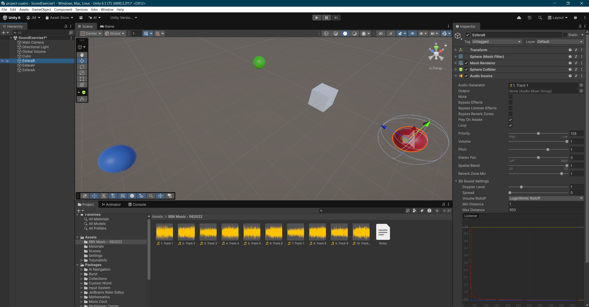
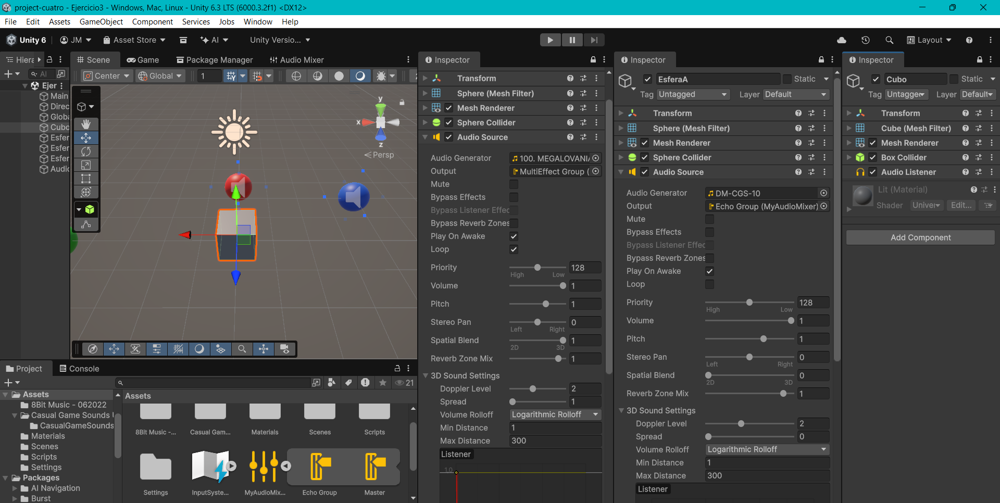
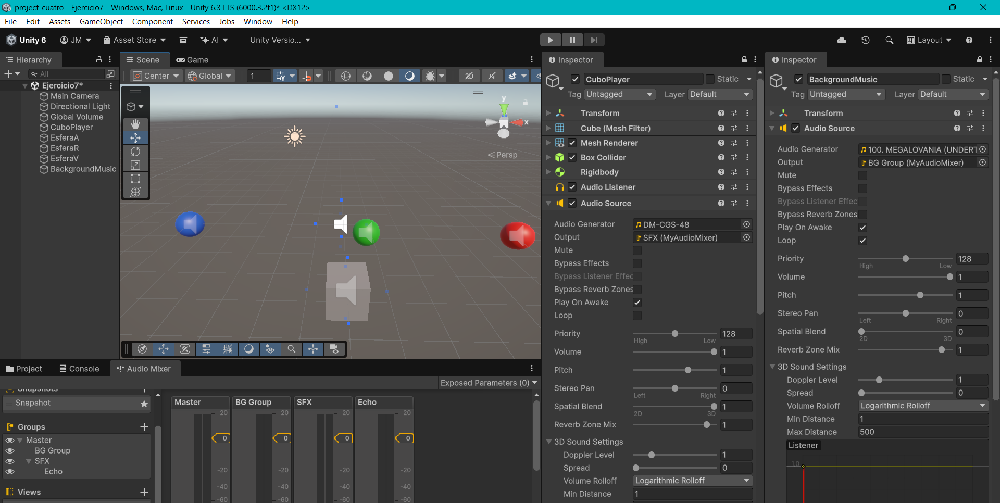
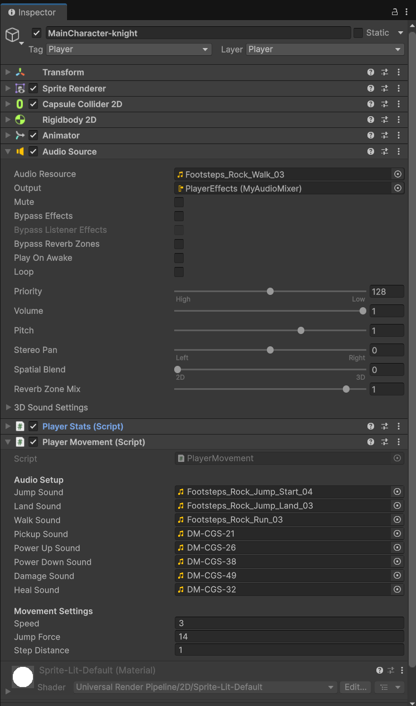

# FDV PRÁCTICA 9: Introducción al sonido en Unity

## Alumno
- Nombre: Jaime Madico Cañete
- ALU: alu0100895179
- Correo: alu0100895179@ull.edu.es

### Demostración de ejecución
<video src="Docs/ejercicio9-1.mp4" controls width="500">
Tu navegador no soporta la etiqueta de video.
</video>

## Entorno
- Unity Version: 6.3 - 6000.3.2f1
- Plataforma: Windows 
- Sistema de coordenadas: 3D y 2D
- Input System: Unity New Input System (UnityEngine.InputSystem)
- Componentes clave: AudioSource, AudioListener, AudioMixer, AudioReverbZone, AudioEffects, AudioClip
- Assets externos: Paquete de sonidos (Asset Store)
- Control de versiones: Git (repositorio en GitHub)  
- Entrega: Repositorio + GIF demostrativo + .zip en Campus Virtual

## Resumen
En esta práctica se exploran las capacidades del motor de audio de Unity para crear experiencias inmersivas. Se estudian los componentes fundamentales como `AudioSource` y `AudioListener`, así como la configuración de sonido espacial (3D) y el efecto Doppler.

Se profundiza en el uso de **Audio Mixers** para la gestión profesional de volúmenes y efectos (como eco o reverberación) mediante grupos y buses. Además, se implementa la lógica de audio mediante **Scripts** (C#), controlando la reproducción, pausa, bucles y la variación dinámica de parámetros como el `pitch` o el volumen en función de físicas (velocidad de impacto).

Finalmente, se integran estos conocimientos en el proyecto 2D previo, organizando el audio en canales (SFX, Música, Ambiente) y añadiendo *feedback* auditivo a las mecánicas de juego.

---

## Ficheros más importantes entregados

- PRACTICA.md
- Assets/
  - Audio/
  - Scripts/
    - ejercicio4.cs
    - ejercicio5.cs
    - ejercicio6.cs
    - ejercicio8.cs
    - MovimientoDoppler.cs
    - MovimientoSimple.cs
  - Scenes/
    - Ejercicio1.unity
    - Ejercicio2.unity
    - Ejercicio3.unity
    - Ejercicio4.unity
    - Ejercicio5.unity
    - Ejercicio6.unity
    - Ejercicio7.unity
    - Ejercicio8.unity
    - SampleScene.unity
- Assets2D/
  - Audio/
  - Scripts/
    - PlayerMovement.cs
    - PlayerStats.cs
    - CollectiblePotionPooled.cs
    - AmbienceSoundZone.cs

---

## Enunciado general de la práctica

El objetivo es configurar objetos que emiten sonidos y estudiar los factores que afectan a cómo estos son percibidos por el oyente (distancia, dirección, efecto Doppler, entorno). Se trabajará con fuentes de sonido (`AudioSource`) y oyentes (`AudioListener`), así como con el mezclador (`AudioMixer`) para aplicar efectos.

Se desarrollarán ejercicios tanto en una escena 3D simple como la integración final en el proyecto 2D.

---

### Tarea 1: Configuración de escena simple 'On Awake' y 'Loop'

*Enunciado: Configurar una escena simple en 3D con un objeto cubo que hará de player y varias esferas de color. Agregar un objeto AudioSource con un clip de audio que se reproduzca al cargar la escena y en bucle.*

- **Configuración:**
He creado una escena con un cubo y varias esferas (Rojo, Azul y Verde). A la esfera rojka le he añadido el componente `AudioSource`.
    * **Audio Generator (AudioClip):** Asignado un sonido descargado de la `Asset Store`: ***1. Track 1***.
    * **Play On Awake:** Activado (se reproduce al inicio).
    * **Loop:** Activado (reproducción continua).
    * **Spatial Blend:** Ajustado a 1 (3D) para que el sonido tenga posición en el espacio.



---

### Tarea 2: Efecto Doppler y configuración sonido 3D

*Enunciado: Crear un objeto con una fuente de audio con efecto Doppler elevado que se mueva a alta velocidad. Explicar los efectos al modificar parámetros.*

He configurado una esfera con un script de movimiento rápido para probar el efecto `Doppler` (la distorsión del tono por la velocidad relativa).

* **Configuración del script `MovimientoDoppler.cs`:**
```csharp
public class MovimientoDoppler : MonoBehaviour
{
    public float speed = 10f;

    void Update()
    {
        // Verificamos si existe un teclado conectado y si la tecla M está presionada
        if (Keyboard.current != null && Keyboard.current.mKey.isPressed)
        {
            transform.Translate(Vector3.forward * speed * Time.deltaTime);
        }
        else if (Keyboard.current != null && Keyboard.current.nKey.isPressed)
        {
            transform.Translate(Vector3.forward * speed * Time.deltaTime * -1);
        }
    }
}
```

* **Conclusiones:** ya con ese script podemos escuchar los efectos del sonido 3D en un objeto en movimiento, por ejemplo usando auriculares, como pasa de escucharse de derecha a izquierda, así como la diferencia de volumen según la distancia. Al aumentar el `Doppler Level` se hace aún más evidente la distorsión, asemejándose al de un objeto que pasa a gran velocidad (como en las carreras de F1).

[Ver vídeo del ejercicio 2](Docs/ejercicio2-1.mp4)

* **Experimentos realizados:**

1.  **Incrementar el valor del parámetro `Spread`:**
    * *Explicación:* Al aumentar el `Spread`, el sonido empieza a tener una mayor dispersión y menos direccionalidad precisa, en cierto modo  ganando presencia ambiental. Haciendo pruebas de direccionalidad, colocando la fuente de sonido a la derecha, si se establece a `180` da la sensación de que el sonido viene de igual forma por todas direcciones, si llego hasta 360, ya directamente pareciera que viene de la dirección opuesta.

    [Ver vídeo del ejercicio 2.1](Docs/ejercicio2-1.mp4)

2.  **Cambiar `Min Distance` y `Max Distance`:**
    * *Explicación:* `Min Distance` define el radio donde el sonido se escucha al máximo volumen. `Max Distance` es el punto donde el sonido deja de atenuarse (o se silencia, dependiendo del `Rolloff`). Ajustando esto controlamos el alcance real del audio. Por ello, por ejemplo, si vamos aumentando el valor mínimo, vamos viendo como va aumentando cada vez más el volumen aunque no se mueva la esfera. Para `Max Distance` se hace más evidente la modificación si usamos `Lineal Rolloff`.

    [Ver vídeo del ejercicio 2.2](Docs/ejercicio2-3.mp4)

3.  **Cambiar de `Logarithmic Rolloff` a `Linear Rolloff`:**
    * *Explicación:* El modo Logarítmico simula la realidad (el sonido decae rápido al principio y luego lento). El modo Lineal baja el volumen de forma constante y artificial, útil para mecánicas de juego específicas pero menos realista

    [Ver vídeo del ejercicio 2.3](Docs/ejercicio2-4.mp4)

*Enunciado: Prueba sencilla de `ReverbZone`.*

Para realizar esta prueba, he cambiado el `Audio Listener` de la cámara al cubo de la escena. He configurado la `Reverb Zone` tal y como se indica en el enunciado, `Min Distance` a *5* y `Max Distance` a *10*. Para que se note más el efecto he cambiado el `Preset` a `Sewerpipe`. 

[Ver vídeo del ejercicio 2.4](Docs/ejercicio2-5.mp4)

---

### Tarea 3: Audio Mixer y Efectos

*Enunciado: Configurar un mezclador de sonidos, aplica a uno de los grupo un filtro de echo y el resto de filtros libre. Configura cada grupo y masteriza el efecto final de los sonidos que estás mezclando. Explica los cambios que has logrado con tu mezclador.*

He configurado un `AudioMixer` llamado **MyAudioMixer** organizando el flujo de audio en dos grupos diferenciados (además del *Master*) para procesar de forma independiente un efecto de sonido y una pista musical.

- **Configuración de Grupos:**
    * **Echo Group:** A este grupo he enviado la salida (`Output`) del `AudioSource` de la esfera azul, que reproduce un sonido de impacto ("DM-CGS-10"). Le he aplicado el efecto **Echo** (con un *Delay* de 2000ms y *Decay* del 31.8%), lo que genera repeticiones marcadas del golpe, simulando un entorno amplio con rebote.
    * **MultiEffect Group:** A este grupo he enviado la salida de la esfera roja, que reproduce la pista musical "*MEGALOVANIA*". He diseñado una cadena de efectos creativa:
        * **Chorus:** Para dar amplitud estéreo y modulación.
        * **Pitch Shifter:** Configurado a **0.90 x**, lo que reduce el tono de la canción haciéndola sonar más grave y "lenta".
        * **Duck Volume:** Encargado de recibir la señal desde el otro grupo (*Echo Group*), para reducir el volumen (en un porcentaje definido en `Ratio`) de la canción cuando se supera el umbral de la intensidad de sonido (`Treshold`).




- **Cambios logrados:**
He logrado masterizar la escena separando las frecuencias y los ambientes. La música de fondo suena ahora más pesada y distorsionada gracias al *Pitch Shifter* y *Chorus*, mientras que el sonido de impacto en la esfera se mantiene nítido pero con una cola de eco larga que no se mezcla con los efectos de la música. He decidido no aplicar la configuración `Loop`al sonido del golpe para que se note más fácilmente el efecto de eco.

<video src="Docs/ejercicio3-3.mp4" controls width="500">
Tu navegador no soporta la etiqueta de video.
</video>

---

### Tarea 4: Audio vía `Scripts` (Play/Stop)

*Enunciado: Implementar un script que al pulsar la tecla p accione el movimiento de una esfera en la escena y reproduzca un sonido en bucle hasta que se pulse la tecla s.*

He implementado el script `ejercicio4.cs` utilizando el **New Input System** para detectar pulsaciones de teclas y controlar tanto el movimiento como la reproducción del audio.

- **Script `ejercicio4.cs`:**

```csharp
void Start()
{
    // Obtenemos la referencia al AudioSource
    mySound = GetComponent<AudioSource>(); 
}

void Update()
{
    if (Keyboard.current == null) return;
    
    // Usamos 'wasPressedThisFrame' para detectar solo el instante de la pulsación
    // Al pulsar 'P' -> Activar movimiento y sonido
    if (Keyboard.current.pKey.wasPressedThisFrame)
    {
        moving = true;
        
        // Si no está sonando ya, le damos play y nos aseguramos que esté en bucle
        if (!mySound.isPlaying)
        {
            mySound.loop = true;
            mySound.Play();
        }
    }

    // Al pulsar 'S' -> Parar, silenciar y cambiar dirección
    if (Keyboard.current.sKey.wasPressedThisFrame)
    {
        moving = false;
        mySound.Stop();
        mySound.loop = false;
        
        direction *= -1; 
        Debug.Log("Dirección cambiada. Ahora es: " + direction);
    }

    // Lógica de movimiento constante
    if (moving)
    {
        // Se moverá hacia adelante o atrás dependiendo de la variable 'direction'
        transform.Translate(Vector3.forward * velocidad * Time.deltaTime * direction);
    }
}
```

- **Explicación del funcionamiento:**
    * **Control de entrada:** Utilizo `Keyboard.current.key.wasPressedThisFrame` para capturar el evento único de pulsar la tecla, evitando que se dispare múltiples veces si se mantiene pulsada.
    * **Gestión de audio:**
        * Al pulsar **'P'**, verifico `!mySound.isPlaying` antes de llamar a `Play()` para evitar reiniciar el clip si ya estaba sonando. Activo `loop = true` para que el sonido no cese mientras la esfera se mueve.
        * Al pulsar **'S'**, utilizo `Stop()` para detener el audio inmediatamente y desactivo el bucle.
    * **Lógica de movimiento:** Utilizo una variable booleana `moving` para permitir el desplazamiento en el `Update`. Además, he añadido una variable `direction` (1 o -1) que se invierte cada vez que paramos el objeto, haciendo que la esfera cambie de sentido la próxima vez que arranque.

<video src="Docs/ejercicio4-1.mp4" controls width="500">
Tu navegador no soporta la etiqueta de video.
</video>

---

### Tarea 5: Sonido por colisión

*Enunciado: Implementar un script en el que el cubo-player al colisionar con las esferas active un sonido.*

He implementado el script `ejercicio5.cs` utilizando la detección de **Triggers**. En la escena, he configurado los **Colliders** de las esferas marcando la casilla **Is Trigger**, permitiendo que el cubo detecte la entrada en su volumen sin producir un choque físico sólido.

- **Script `ejercicio5.cs`:**
```csharp
// Variable pública para asignar el sonido de choque desde el Inspector.
// Es útil para usar PlayOneShot y que el sonido no se corte si hay muchos choques seguidos.
public AudioClip collisionClip; 

void Start()
{
    // Obtenemos la referencia al AudioSource de este mismo objeto
    mySound = GetComponent<AudioSource>();
}

// Haremos la comprobación de colisión con la opción 'IsTrigger'
void OnTriggerEnter(Collider other)
{
    if (collisionClip != null)
    {
        mySound.PlayOneShot(collisionClip);
    }
    else
    {
        // Si no asignamos variable, reproduce el que tenga el AudioSource por defecto
        mySound.Play();
    }

    Debug.Log("¡Colisión detectada (Trigger) con: " + other.gameObject.name + "!");
}
```

- **Explicación del funcionamiento:**
    * **Detección (`OnTriggerEnter`):** Al usar Triggers, el evento se dispara cuando el cubo entra en el área de la esfera.
    * **Variable pública (`collisionClip`):** He creado un campo público para arrastrar el clip de audio específico de "choque" desde el `Inspector`, lo que hace el código más flexible.
    * **Uso de `PlayOneShot`:** Esta función es muy adecuada para sonidos de impacto o colisión. A diferencia de `Play()` (que detiene el sonido actual para empezar de nuevo), `PlayOneShot` reproduce el sonido una vez encima de lo que ya esté sonando. Esto evita cortes bruscos si el jugador atraviesa varias esferas rápidamente.

<video src="Docs/ejercicio5-1.mp4" controls width="500">
Tu navegador no soporta la etiqueta de video.
</video>

---

### Tarea 6: Volumen dinámico por impacto

*Enunciado: Modificar el script anterior para que según la velocidad a la que se impacte, el sonido sea más fuerte o más débil.*

He implementado el script `ejercicio6.cs` añadiendo una lógica para calcular manualmente la velocidad del objeto en cada *frame* de física, y usar ese valor para modular el volumen del impacto.

- **Script `ejercicio6.cs`:**

```csharp
using UnityEngine;

public class ejercicio6 : MonoBehaviour
{
    // Variable pública para asignar sonido desde el inspector
    public AudioClip collisionClip;
    private AudioSource mySound;
    
    // A esta velocidad sonará con el volumen a su máximo. Si va a 5, sonará a la mitad.
    public float maxSpeedVolume = 10f;

    // Variables para calcular la velocidad manual
    private Vector3 lastPos;
    private float actualSpeed;

    void Start()
    {
        mySound = GetComponent<AudioSource>();
        lastPos = transform.position;
    }

    // Usamos FixedUpdate para calcular físicas/velocidad de forma constante
    void FixedUpdate()
    {
        // Distancia que se ha movido desde el último frame
        float movSpace = Vector3.Distance(transform.position, lastPos);

        // Velocidad = Espacio / Tiempo
        actualSpeed = movSpace / Time.fixedDeltaTime;

        // Actualizamos la posición para el siguiente cálculo
        lastPos = transform.position;
    }


    void OnTriggerEnter(Collider other)
    {
        // Calculamos el volumen en función de la velocidad con la fórmula: Velocidad / maxVolume
        // Mathf.Clamp01 asegura que el volumen nunca sea menor que 0 ni mayor que 1
        float dynamicVolume = Mathf.Clamp01(actualSpeed / maxSpeedVolume);

        if (collisionClip != null)
        {
            // Pasamos el volumen como segundo argumento a PlayOneShot
            mySound.PlayOneShot(collisionClip, dynamicVolume);
        }
        else
        {
            // Si usamos Play() normal, ajustamos el volumen del AudioSource antes de sonar
            mySound.volume = dynamicVolume;
            mySound.Play();
        }

        Debug.Log($"Choque a velocidad: {actualSpeed} -> Volumen aplicado: {dynamicVolume}");
    }
}
```

- **Explicación del funcionamiento:**
    * **Cálculo de velocidad manual:** En lugar de depender de la velocidad del *Rigidbody* (ya que el movimiento lo realizamos llamando directamente a Translate), he implementado mi propio cálculo físico en `FixedUpdate`. Calculo la distancia recorrida desde el último frame (`movSpace`) y la divido entre el tiempo transcurrido (`Time.fixedDeltaTime`) para obtener la velocidad real (s/t).
    * **Volumen dinámico:** En el momento de la colisión (`OnTriggerEnter`), calculo un factor de volumen dividiendo la velocidad actual por una velocidad máxima de referencia (`maxSpeedVolume`).
    * **Normalización (`Mathf.Clamp01`):** Para asegurar que, si el cubo va rapidísimo, el volumen no supere el valor de 1 (lo que podría distorsionar el audio) ni sea negativo.
    * **Modulación:** Finalmente, paso este valor calculado (`dynamicVolume`) como segundo parámetro a `PlayOneShot(clip, volume)`, logrando que los impactos lentos suenen tenues y los rápidos suenen con toda su intensidad.

<video src="Docs/ejercicio6-1.mp4" controls width="500">
Tu navegador no soporta la etiqueta de video.
</video>

---

### Tarea 7: Sonido de fondo y `Mixer`

*Enunciado: Agregar un sonido de fondo a la escena que se esté reproduciendo continuamente desde que esta se carga. Usar un mezclador para los sonidos.*

He integrado una banda sonora continua en la escena y he organizado las salidas de audio hacia los grupos correspondientes del **AudioMixer** para tener un control de mezcla completo.

- **Configuración realizada:**
    1.  **Objeto `BackgroundMusic`:** He creado un GameObject vacío dedicado exclusivamente a la música.
        * **AudioClip:** Asignada la pista "100. MEGALOVANIA".
        * **Output:** Enviado al grupo **BG Group** (Background Group) del `AudioMixer`.
        * **Play On Awake & Loop:** Activados ambos para que la música arranque al inicio y nunca se detenga.
        * **Spatial Blend:** Configurado completamente a **2D (0)**. Es una configuración adecuada para la música de fondo, ya que asegura que se escuche con el mismo volumen estéreo independientemente de dónde esté la cámara o el jugador en el mundo 3D.

    2.  **Objeto `CuboPlayer`:** He aprovechado para asignar también la salida de su AudioSource (el que produce los sonidos de choque) al grupo **SFX** del Mixer. Además el resto de los sonidos podrían asginar su *Output* también a este u otro grupo nuevo según corresponda.

- **Resultado:**
    Ahora tengo canales independientes para la música y los efectos de sonido. Esto me permite, por ejemplo, bajar el volumen de la música sin afectar a la intensidad de los golpes, o aplicar efectos ambientales solo a los efectos de sonido (*SFX*) manteniendo la música limpia.



---

### Tarea 8: Sonidos de pasos (movimiento)

*Enunciado: Crear un script para simular el sonido que hace el cubo-player cuando está movimiento en contacto con el suelo (mecánica para reproducir sonidos de pasos).*

He implementado el script `ejercicio8.cs` para gestionar la reproducción de pasos. He añadido un plano de color naranja en la escena que actúa como suelo para que el `Raycast` pueda detectar la colisión. Para el sonido de los pasos, he añadido un paquete gratuito de la `Asset Store` que incluye diferentes sonidos de pasos.

- **Script `ejercicio8.cs`:**
```csharp
public class ejercicio8 : MonoBehaviour
{
    private AudioSource mySound;
    private Vector3 lastPosition;

    // Para comprobar si tocamos el suelo
    public float groundDistance = 0.5f;

    // Variables para controlar el ritmo de los pasos
    // Cada cuánto tiempo suena un paso (0.5 = 2 pasos por segundo)
    public float stepRate = 0.5f; 
    private float nextStepTime = 0f;

    void Start()
    {
        // Obtenemos la referencia al AudioSource
        mySound = GetComponent<AudioSource>();
        
        // Inicializamos la primera posición como el primer valor de "last"
        lastPosition = transform.position;
    }

    void Update()
    {
        // Comprobamos si la distancia recorrida desde el último frame es relevante
        bool isMoving = Vector3.Distance(transform.position, lastPosition) > 0.01f;

        // Lanzamos un rayo hacia abajo para ver si tocamos suelo
        bool isGrounded = Physics.Raycast(transform.position, Vector3.down, groundDistance);

        // Lógica de 'steps'
        // Solo entramos si nos movemos, tocamos suelo y ha pasado el tiempo suficiente
        if (isMoving && isGrounded && Time.time >= nextStepTime)
        {
            mySound.PlayOneShot(mySound.clip);

            // Reseteamos el reloj: "No vuelvas a sonar hasta dentro de 'stepRate' segundos"
            nextStepTime = Time.time + stepRate;
        }

        // Actualizamos la posición para el siguiente frame
        lastPosition = transform.position;
    }
}
```

- **Explicación del funcionamiento:**
    * **Detección de movimiento:** En cada frame comparo la posición actual con la `lastPosition`. Si la distancia es mayor a un umbral mínimo (0.01f), considero que el cubo se está moviendo.
    * **Detección de suelo (`Physics.Raycast`):** Lanzo un rayo invisible hacia abajo (`Vector3.down`) de longitud `groundDistance`. Esto evita que suenen pasos si el cubo está saltando o en el aire.
    * **Control de Ritmo (`stepRate`):** Si simplemente reprodujera el sonido al moverse, sonaría en cada frame haciendo un estruendo debido a las repeticiones. He implementado un temporizador (`nextStepTime`) que obliga a esperar un tiempo (ej: 0.5 segundos) entre paso y paso, logrando un ritmo natural de caminata.

<video src="Docs/ejercicio8-1.mp4" controls width="500">
Tu navegador no soporta la etiqueta de video.
</video>

---

### Tarea 9: Integración en Proyecto 2D

*Enunciado: Incorporar efectos de sonido en la escena 2D con grupos en el AudioMixer (SFX, Ambiente, Música), sonidos de movimiento, interacción, salud y zonas de ambiente específicas.*

He integrado un sistema de audio completo en el proyecto 2D existente, organizando las fuentes a través de un **AudioMixer** y programando la lógica en C# para sincronizar el sonido con las mecánicas de juego.

#### 1. Configuración del *AudioMixer*
He creado un asset `MyAudioMixer` y he estructurado los canales para tener control independiente de los volúmenes.
* **Grupos creados:**
    * **Master:** Canal principal.
    * **Music:** Para la música de fondo (volumen atenuado a -20dB para no molestar).
    * **SFX:** Para sonidos de otros objetos o actores interactivos, por ejemplo en mi escena corresponderá con una fogata cuando nos acercamos. 
    * **PlayerEffects:** Subgrupo para los sonidos emitidos por el jugador (pasos, salto, etc.).
    * **Ambience:** Para el sonido de fondo atmosférico (bosque, sonido de la tienda, etc.).

#### 2. Implementación de música y ambiente Global
He creado dos GameObjects en la escena (`BGMusic` y `BGAmbience`) con componentes `AudioSource` configurados en **Loop** y **Play On Awake**, ya que en principio deben sonar desde un principio y sin pausa.
* **Música:** Reproduce el track "`8-BIT-ARCADE`" y su salida va al grupo *Music*.
* **Ambiente global:** Reproduce un sonido de bosque ("`forest`") y va al grupo *Ambience*.

#### 3. Zona de ambiente específica (Script `AmbienceSoundZone`)
He creado el script `AmbienceSoundZone.cs` y lo he aplicado en dos situaciones distintas con comportamientos diferentes:

* **Caso A: Tienda NPC (`shopNPC`).** He configurado una zona alrededor del vendedor mediante un *collider*.
    * **Audio:** Reproduce "`medieval_village`" enviada al grupo **Ambience**.
    * **Comportamiento:** Al entrar, **pausa** el ambiente global (bosque) para que se escuche bullicio. Al salir, reanuda el bosque.
    * **Configuración:** En el inspector, he arrastrado el objeto `BGAmbience` a la variable pública `Global Ambience`.

* **Caso B: Fuego estático (`StaticFire`).** He configurado una zona alrededor de una hoguera.
    * **Audio:** Reproduce "`fire-sounds`" enviada al grupo **SFX** (es un efecto puntual, no un ambiente).
    * **Comportamiento:** Aquí **NO** he configurado que se detenga el sonido del bosque; quiero que el crepitar del fuego se mezcle con él.
    * **Configuración:** En el inspector, he dejado la variable `Global Ambience` **vacía (None)**.

* **Lógica del Script:**
    El script detecta la entrada y salida mediante *Triggers*. La versatilidad reside en el condicional `if (globalAmbience != null)`. Si la variable tiene asignado un AudioSource (caso Tienda), lo pausa. Si está vacía (caso Fuego), ignora la pausa y permite la reproducción simultánea.

```csharp
void OnTriggerEnter2D(Collider2D other)
{
    if (other.CompareTag("Player"))
    {
        if (!localAmbience.isPlaying)
        {
            localAmbience.Play();
        }

        if (globalAmbience != null) 
        {
            globalAmbience.Pause();
        }
    }
}

void OnTriggerExit2D(Collider2D other)
{
    if (other.CompareTag("Player"))
    {
        localAmbience.Stop();

        if (globalAmbience != null)
        {
            globalAmbience.UnPause(); 
        }
    }
}
```

#### 4. Sonidos del MainPlayer (`PlayerMovement.cs`)
He modificado el script de movimiento para gestionar múltiples eventos sonoros, asignando sus salidas al grupo *PlayerEffects*.

* **Pasos (`HandleFootsteps`):** En lugar de reproducir el sonido en cada frame, calculo la distancia recorrida (`distanceMoved`). Cuando supera el umbral `stepDistance` (0.8f), reproduzco un paso (`walkSound`) con una ligera variación aleatoria de `pitch` (0.9 a 1.1) para evitar que sea algo más natural.
* **Salto:** Al ejecutar `PerformJump`, se lanza el sonido `jumpSound` con `PlayOneShot`.
* **Aterrizaje (Land):** En `FixedUpdate` almaceno la velocidad vertical (`previousVelocityY`). En `OnCollisionEnter2D`, si detecto que he tocado suelo y venía cayendo con fuerza (velocidad < -2f), reproduzco el sonido de aterrizaje `landSound`. Esto evita que suene al caminar por pendientes o si se dan microvariaciones.

#### 5. Gestión de recolectables y salud (`PlayerStats.cs`)
He conectado la lógica de juego con el sistema de audio mediante métodos públicos en el jugador:

* **Recolección:** El script `CollectiblePotionPooled` llama a `player.CollectItem()`, que reproduce el sonido de *pickup*.
* **Salud (Daño/Cura):** He implementado un sistema de pruebas con las teclas **'M'** (Curar) y **'N'** (Dañar). Al pulsarlas, `PlayerStats` modifica las vidas y solicita a `PlayerMovement` que reproduzca `healSound` o `damageSound` mediante el método auxiliar `PlayImportantSound()`, el cual resetea el pitch a 1 para asegurar que estos sonidos críticos se escuchen claros.

* **Nota:** En este proyecto se han modificado los scripts: `PlayerMovement.cs`, `PlayerStats.cs` y `CollectiblePotionPooled.cs`. También se ha generado un nuevo script: `AmbienceSoundZone.cs`.




<video src="Docs/ejercicio9-1.mp4" controls width="500">
Tu navegador no soporta la etiqueta de video.
</video>